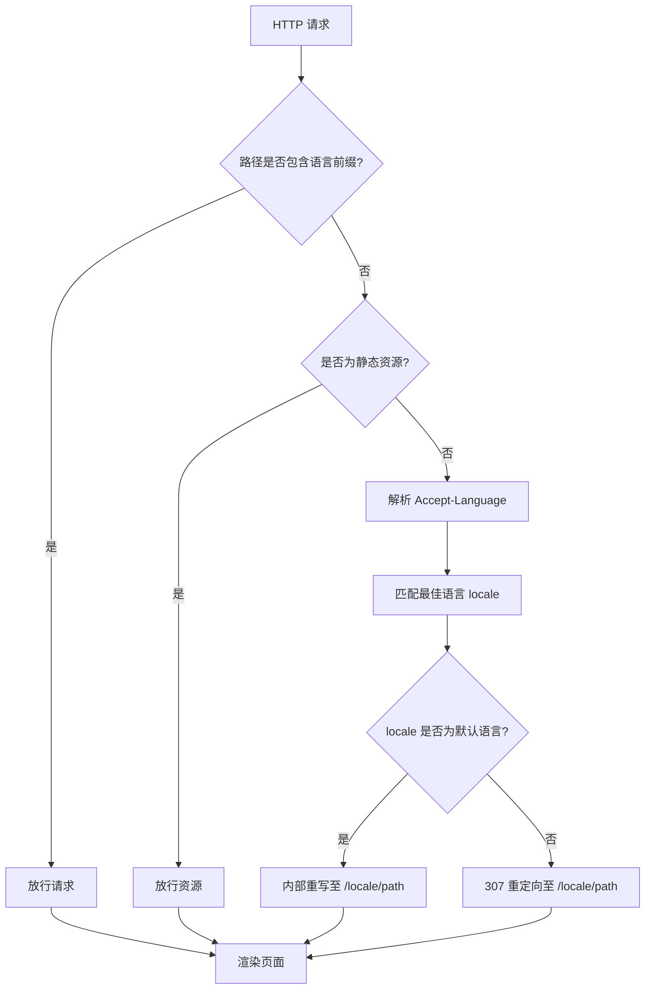

# 中间件与路由控制

<cite>
**Referenced Files in This Document**  
- [middleware.ts](file://middleware.ts)
- [app/[lng]/layout.tsx](file://app/[lng]/layout.tsx)
- [config.ts](file://config.ts)
- [app/i18n/index.ts](file://app/i18n/index.ts)
</cite>

## 目录
1. [引言](#引言)
2. [中间件实现逻辑](#中间件实现逻辑)
3. [语言检测与匹配机制](#语言检测与匹配机制)
4. [路由重定向策略](#路由重定向策略)
5. [布局组件协作机制](#布局组件协作机制)
6. [动态路由与安全控制](#动态路由与安全控制)
7. [请求处理流程图](#请求处理流程图)
8. [SEO与用户体验影响](#seo与用户体验影响)
9. [结论](#结论)

## 引言
本文档深入分析 `middleware.ts` 文件的实现逻辑及其在 Next.js 应用中对路由控制的关键作用。重点阐述中间件如何拦截所有请求，自动识别用户语言偏好，并通过重定向或重写实现多语言支持。同时说明其与布局组件 `layout.tsx` 的协作机制，确保语言参数正确传递，提升应用的国际化能力。

## 中间件实现逻辑

`middleware.ts` 是整个应用的请求拦截中枢，负责在请求到达页面前进行语言处理。该中间件通过 `NextResponse` 提供的能力，对进入的 HTTP 请求进行预处理，判断是否需要添加语言前缀。

中间件首先提取请求路径 `pathname`，并检查其是否已包含合法语言前缀。若路径已包含语言标识（如 `/zh/home` 或 `/en/about`），则直接放行，避免重复处理。对于静态资源文件（如图片、字体等），通过正则表达式匹配并排除特定文件后，也不进行重定向，以提升性能。

**Section sources**  
- [middleware.ts](file://middleware.ts#L1-L50)

## 语言检测与匹配机制

系统通过 `getLocale` 函数从请求头中提取用户的语言偏好。该函数利用 `Negotiator` 库解析 `Accept-Language` 请求头，获取客户端支持的语言列表，并结合 `@formatjs/intl-localematcher` 进行最佳匹配。

匹配过程基于项目配置的 `locales` 数组（当前为 `["zh", "en"]`）和默认语言 `defaultLocale`（当前为 `"zh"`）。`match` 函数会根据用户浏览器的语言优先级，选择最合适的语言代码。例如，当用户偏好为 `en-US,en;q=0.9,zh-CN;q=0.8` 时，若系统支持英文，则返回 `"en"`；否则回退到默认的 `"zh"`。

**Section sources**  
- [middleware.ts](file://middleware.ts#L10-L18)
- [config.ts](file://config.ts#L1-L3)

## 路由重定向策略

中间件根据匹配结果决定是否进行路径重写或重定向：

- 若检测到的语言为默认语言（`zh`），则使用 `NextResponse.rewrite` 进行内部重写，用户浏览器地址栏不变，但实际渲染对应语言页面。
- 若检测到非默认语言（如 `en`），则使用 `Response.redirect` 发起 307 临时重定向，将用户引导至 `/en/xxx` 路径，确保 URL 明确反映当前语言。

此策略兼顾了用户体验与 SEO 友好性：默认语言无需重定向，减少网络开销；非默认语言则通过清晰 URL 提升可索引性。

**Section sources**  
- [middleware.ts](file://middleware.ts#L19-L44)

## 布局组件协作机制

`app/[lng]/layout.tsx` 是多语言布局的核心组件，接收动态路由参数 `lng` 并将其注入 HTML 的 `lang` 属性，确保语义化与辅助技术兼容。

该组件通过 `generateStaticParams` 函数在构建时静态生成所有语言版本的路由（`/zh` 和 `/en`），使 Next.js 能够预渲染对应页面，显著提升加载性能并降低服务器负载。中间件确保所有未带语言前缀的请求被正确引导至这些预生成的静态路径。

**Section sources**  
- [app/[lng]/layout.tsx](file://app/[lng]/layout.tsx#L10-L39)

## 动态路由与安全控制

动态路由段 `[lng]` 使用参数化路径匹配机制，仅接受 `config.ts` 中定义的合法语言值（`zh` 或 `en`）。任何非法语言参数（如 `/fr/home`）将导致路由不匹配，触发 404 响应。

中间件在重定向前已通过 `locales.some()` 验证路径是否包含合法语言前缀，从而防止非法语言路径的生成。结合 `generateStaticParams` 的静态生成机制，系统仅对合法语言构建页面，进一步增强了安全性与一致性。

**Section sources**  
- [middleware.ts](file://middleware.ts#L22-L26)
- [app/[lng]/layout.tsx](file://app/[lng]/layout.tsx#L10-L12)

## 请求处理流程图

**Diagram sources**  
- [middleware.ts](file://middleware.ts#L19-L44)
- [config.ts](file://config.ts#L1-L3)

## SEO与用户体验影响

该中间件设计显著提升了应用的 SEO 表现：每个语言版本拥有独立且语义清晰的 URL（如 `/en/page` 和 `/zh/page`），便于搜索引擎索引不同语言内容，避免内容重复问题。

从用户体验角度，系统自动识别用户语言并跳转至对应版本，无需手动选择，降低了使用门槛。同时，静态生成与智能重定向策略确保页面快速加载，提升整体交互流畅度。

**Section sources**  
- [middleware.ts](file://middleware.ts#L1-L50)
- [app/[lng]/layout.tsx](file://app/[lng]/layout.tsx#L10-L39)

## 结论

`middleware.ts` 与 `layout.tsx` 协同构建了一个高效、安全的多语言路由体系。中间件负责请求拦截与语言重定向，布局组件负责静态生成与参数注入，二者结合实现了无缝的国际化体验。该架构不仅提升了 SEO 效果，也优化了性能与用户体验，是现代 Next.js 多语言应用的典范实现。