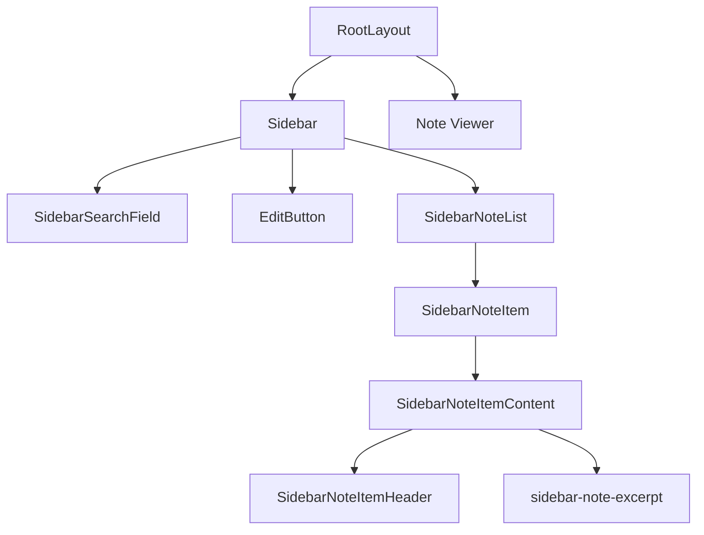
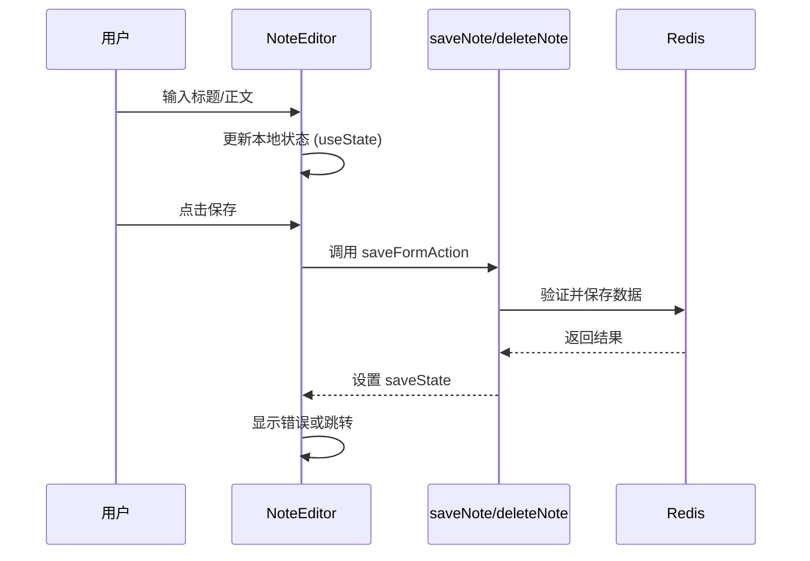
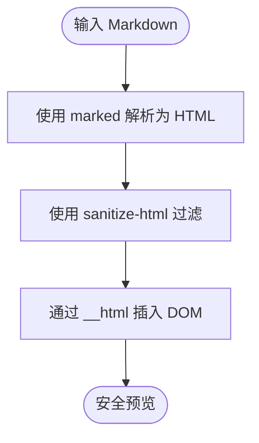
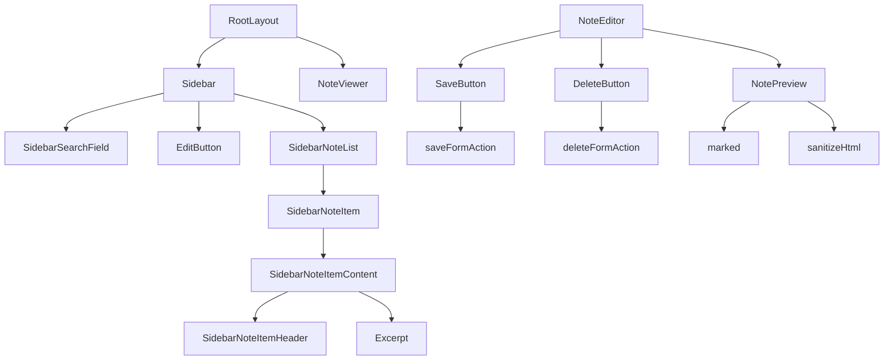
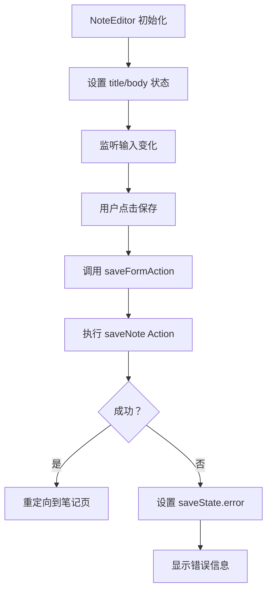

# 前端架构

<cite>
**本文档引用文件**  
- [layout.tsx](file://app/[lng]/layout.tsx)
- [Sidebar.tsx](file://components/Sidebar.tsx)
- [SidebarNoteList.tsx](file://components/SidebarNoteList.tsx)
- [NoteEditor.tsx](file://components/NoteEditor.tsx)
- [NotePreview.tsx](file://components/NotePreview.tsx)
- [SidebarNoteItemContent.tsx](file://components/SidebarNoteItemContent.tsx)
- [SidebarNoteItemHeader.tsx](file://components/SidebarNoteItemHeader.tsx)
- [globals.css](file://public/globals.css)
- [actions.ts](file://app/[lng]/actions.ts)
- [redis.ts](file://lib/redis.ts)
</cite>

## 目录
1. [简介](#简介)
2. [组件树结构与布局机制](#组件树结构与布局机制)
3. [状态管理机制](#状态管理机制)
4. [Markdown 实时预览实现](#markdown-实时预览实现)
5. [UI 组件可复用性设计](#ui-组件可复用性设计)
6. [样式策略与响应式布局](#样式策略与响应式布局)
7. [组件调用关系图](#组件调用关系图)
8. [关键组件使用示例](#关键组件使用示例)

## 简介
本项目为一个基于 Next.js 的笔记应用，采用服务端组件（Server Components）为主、客户端组件（Client Components）为辅的混合架构。前端架构围绕组件化、状态管理、安全渲染和响应式设计展开，重点实现笔记列表管理、编辑器交互与实时预览功能。

## 组件树结构与布局机制

项目采用 `RootLayout` 作为根布局组件，定义全局 HTML 结构并注入语言参数。`RootLayout` 内嵌套 `Sidebar` 组件与动态内容区域，形成主侧边栏布局结构。

`Sidebar` 组件作为侧边栏容器，包含搜索框、新建按钮及笔记列表。其通过 `Suspense` 包裹 `SidebarNoteList` 实现异步加载占位，提升用户体验。`SidebarNoteList` 从 Redis 获取所有笔记数据，并将每条笔记封装为 `SidebarNoteItem` 渲染。

**组件嵌套关系如下：**
- `RootLayout`
  - `Sidebar`
    - `SidebarSearchField`
    - `EditButton`
    - `SidebarNoteList`
      - `SidebarNoteItem`
        - `SidebarNoteItemContent`
          - `SidebarNoteItemHeader`
          - `sidebar-note-excerpt`

**组件来源**
- [layout.tsx](file://app/[lng]/layout.tsx#L19-L38)
- [Sidebar.tsx](file://components/Sidebar.tsx#L9-L39)
- [SidebarNoteList.tsx](file://components/SidebarNoteList.tsx#L4-L28)

## 状态管理机制

`NoteEditor` 作为客户端组件，使用 `useActionState` 管理表单提交状态与错误反馈。该 Hook 与服务端 Action 函数 `saveNote` 和 `deleteNote` 配合，实现无刷新表单处理。

`useActionState` 返回三元组：当前状态、绑定的 action 函数、是否处于 pending 状态。当用户点击保存或删除按钮时，触发对应 action，更新状态并自动重新渲染组件。若操作失败，错误信息将通过 `saveState.error` 或 `deleteState.error` 显示在界面上。

此外，`NoteEditor` 使用 `useState` 管理标题与正文的本地输入状态，确保实时响应用户输入。

**组件来源**
- [NoteEditor.tsx](file://components/NoteEditor.tsx#L14-L91)
- [actions.ts](file://app/[lng]/actions.ts#L40-L75)

## Markdown 实时预览实现

`NotePreview` 组件负责将用户输入的 Markdown 文本安全地渲染为 HTML 预览。其实现基于两个核心库：`marked` 用于解析 Markdown，`sanitize-html` 用于过滤潜在危险 HTML 标签。

组件定义了允许的标签集合（如 img, h1-h3）和属性（如 img[src, alt]），防止 XSS 攻击。由于 `marked` 是异步函数，`NotePreview` 被声明为 `async` 组件，在服务端完成 HTML 转换后返回结果。

最终通过 `dangerouslySetInnerHTML` 将净化后的 HTML 插入 DOM，结合 Tailwind CSS 类 `text-with-markdown` 实现样式统一。

**组件来源**
- [NotePreview.tsx](file://components/NotePreview.tsx#L22-L40)
- [globals.css](file://public/globals.css#L300-L350)

## UI 组件可复用性设计

项目遵循职责分离原则，提升组件复用性。典型案例如 `SidebarNoteItemContent` 与 `SidebarNoteItemHeader` 的拆分：

- `SidebarNoteItemHeader` 仅负责渲染笔记标题与更新时间，输出结构化 `<header>` 元素。
- `SidebarNoteItemContent` 作为容器组件，管理展开/收起状态、路由跳转逻辑与动画效果，接收 `header` 和 `expandedChildren` 作为插槽内容。

这种设计使 `SidebarNoteItemContent` 可复用于不同场景，仅通过 props 注入内容，避免逻辑重复。同时，`EditButton`、`SaveButton` 等按钮组件也通过 `children` 和 `disabled` 状态实现高度可配置。

**组件来源**
- [SidebarNoteItemContent.tsx](file://components/SidebarNoteItemContent.tsx#L1-L100)
- [SidebarNoteItemHeader.tsx](file://components/SidebarNoteItemHeader.tsx#L7-L17)

## 样式策略与响应式布局

项目采用 Tailwind CSS 与自定义 `globals.css` 结合的样式策略。Tailwind 提供原子化类名支持响应式断点（如 `md:flex`），而 `globals.css` 定义设计系统变量（颜色、字体、阴影）与全局重置。

响应式布局通过 Flexbox 实现：`.main` 容器使用 `display: flex`，侧边栏固定宽度（`min-width: 250px`），内容区 `flex-grow: 1` 自适应。移动端通过媒体查询调整间距与字体。

主题一致性由 CSS 自定义属性保障，如 `--primary-blue` 统一用于链接、按钮与边框，确保视觉统一。动画效果（如 flash、slideIn）也集中定义于 `globals.css`。

**组件来源**
- [globals.css](file://public/globals.css#L1-L692)
- [layout.tsx](file://app/[lng]/layout.tsx#L1-L38)

## 组件调用关系图

**图表来源**
- [layout.tsx](file://app/[lng]/layout.tsx#L19-L38)
- [Sidebar.tsx](file://components/Sidebar.tsx#L9-L39)
- [NoteEditor.tsx](file://components/NoteEditor.tsx#L14-L91)

## 关键组件使用示例

`NoteEditor` 接收 `noteId`、`initialTitle` 和 `initialBody` 作为 props，初始化编辑状态。表单字段与本地状态双向绑定，提交时通过隐藏字段传递数据至服务端 action。

错误处理通过 `useEffect` 监听 `saveState` 变化，将错误信息展示在预览区域上方。删除按钮仅在非草稿状态下显示，确保数据安全。

**组件来源**
- [NoteEditor.tsx](file://components/NoteEditor.tsx#L14-L91)
- [actions.ts](file://app/[lng]/actions.ts#L40-L75)