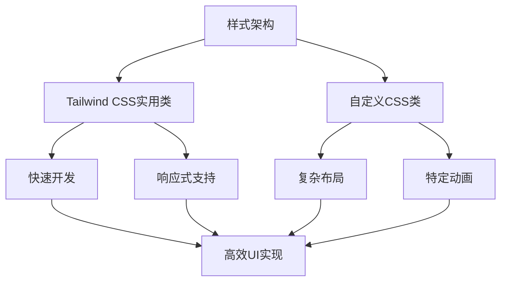
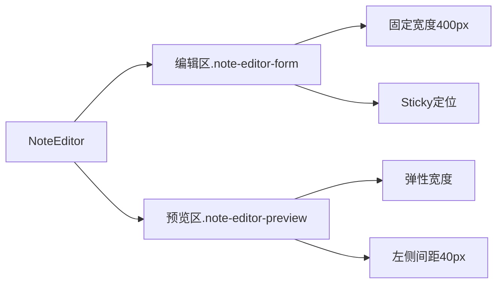

# 样式策略

<cite>
**本文档中引用的文件**  
- [globals.css](file://public/globals.css)
- [NoteEditor.tsx](file://components/NoteEditor.tsx)
- [Sidebar.tsx](file://components/Sidebar.tsx)
</cite>

## 目录
1. [项目结构](#项目结构)
2. [核心样式架构](#核心样式架构)
3. [全局样式与Tailwind协同策略](#全局样式与tailwind协同策略)
4. [NoteEditor组件样式分析](#noteeditor组件样式分析)
5. [Sidebar组件样式实现](#sidebar组件样式实现)
6. [响应式与可访问性设计](#响应式与可访问性设计)

## 项目结构

项目采用Next.js App Router架构，样式系统由Tailwind CSS与自定义CSS文件共同构成。核心样式文件`globals.css`位于`public/`目录下，通过CDN方式引入。组件级样式主要通过Tailwind的实用类（utility classes）在JSX中直接声明，同时结合`globals.css`中的自定义CSS类实现复杂布局和特定视觉效果。

**Section sources**
- [globals.css](file://public/globals.css)
- [NoteEditor.tsx](file://components/NoteEditor.tsx)
- [Sidebar.tsx](file://components/Sidebar.tsx)

## 核心样式架构

项目采用混合式样式架构，结合了Tailwind CSS的原子化实用类和传统的CSS自定义类。这种架构既保留了Tailwind快速开发、一致性高的优点，又通过`globals.css`解决了Tailwind在复杂布局和特定动画效果上的局限性。

**Diagram sources**
- [globals.css](file://public/globals.css)

## 全局样式与Tailwind协同策略

### 容器与布局系统
`globals.css`定义了基础的布局容器类，与Tailwind的响应式工具类协同工作：
- `.container` 和 `.main` 类构建了应用的主容器，采用Flexbox布局实现自适应高度
- `.col` 类作为列容器，通过`flex-grow: 1`实现最后一列的自动扩展
- 这些基础类与Tailwind的`w-full`、`h-screen`等类结合，构建了灵活的响应式布局

### 基础组件样式
`globals.css`定义了一系列基础UI组件的样式：
- `.link--unstyled`：移除链接默认样式的实用类，用于创建无样式的链接容器
- 按钮样式通过`.edit-button`系列类实现，包含`--solid`和`--outline`两种变体
- 表单元素采用CSS Reset策略，确保跨浏览器一致性

### 主题与变量系统
通过CSS自定义属性（CSS Variables）实现了主题系统：
- 颜色变量如`--primary-blue`、`--gray-90`等定义了应用的调色板
- 字体变量`--sans-serif`和`--monospace`确保字体堆栈的一致性
- 阴影变量`--outline-box-shadow`用于焦点状态的视觉反馈

**Section sources**
- [globals.css](file://public/globals.css)

## NoteEditor组件样式分析

### 双栏布局实现
NoteEditor组件采用了经典的双栏编辑布局，通过自定义CSS类与Tailwind实用类的组合实现：

**Diagram sources**
- [NoteEditor.tsx](file://components/NoteEditor.tsx)
- [globals.css](file://public/globals.css)

### 样式类协同工作
- `.note-editor`：主容器，使用Flex布局，占据100%宽高
- `.note-editor-form`：表单容器，固定宽度400px，使用`position: sticky`实现滚动时固定
- `.note-editor-preview`：预览区域，通过`margin-inline-start: 40px`与编辑区保持间距
- 表单内的输入元素结合了Tailwind的`border`、`rounded`和`p-3`等实用类与自定义的字体样式

### 错误提示处理
错误提示采用内联样式（inline styles）实现精确的间距控制：
- 通过`style={{ marginTop: "10px" }}`确保错误信息与上方元素的间距
- 颜色使用内联样式`color: "red"`，避免创建额外的CSS类
- 这种混合方式在保持Tailwind优势的同时，提供了必要的灵活性

**Section sources**
- [NoteEditor.tsx](file://components/NoteEditor.tsx)
- [globals.css](file://public/globals.css)

## Sidebar组件样式实现

### 布局与结构
Sidebar组件展示了Tailwind实用类的典型应用：
- `.flex`布局实现主容器的弹性布局
- `.sidebar-menu`使用`justify-content: space-between`实现菜单项的分布
- 搜索框采用相对定位，为加载指示器提供定位上下文

### 可访问性增强
通过`role`属性增强组件的可访问性：
- `.sidebar-menu`设置`role="menubar"`，表明这是一个菜单栏
- 编辑按钮设置`role="menuitem"`，明确其在菜单中的角色
- 隐藏的标签使用`.offscreen`类，为屏幕阅读器提供上下文

### 动态样式处理
组件根据状态动态应用样式类：
- 使用模板字符串组合`className`，如`["edit-button", isDraft ? "edit-button--solid" : "edit-button--outline"]`
- 状态类如`.note-expanded`和`.flash`通过JavaScript动态添加，实现展开动画和编辑提示

**Section sources**
- [Sidebar.tsx](file://components/Sidebar.tsx)
- [globals.css](file://public/globals.css)

## 响应式与可访问性设计

### 响应式策略
项目采用移动优先的响应式设计：
- 基础布局在移动设备上垂直堆叠
- 在桌面端通过Flexbox实现多栏布局
- 断点控制主要依赖Tailwind的响应式前缀，如`md:flex`、`lg:w-3/4`等

### 可访问性实践
项目遵循WCAG可访问性标准：
- 所有交互元素都有适当的`role`属性
- 隐藏的标签使用`.offscreen`类确保屏幕阅读器可访问
- 焦点状态通过`box-shadow`提供清晰的视觉反馈
- 颜色对比度符合AA级标准，确保文本可读性

### 性能优化
样式系统考虑了性能因素：
- CSS Reset最小化，仅包含必要的重置规则
- 动画使用`transform`和`opacity`属性，避免触发重排
- 频繁变化的状态通过CSS类切换而非内联样式更新

**Section sources**
- [globals.css](file://public/globals.css)
- [NoteEditor.tsx](file://components/NoteEditor.tsx)
- [Sidebar.tsx](file://components/Sidebar.tsx)