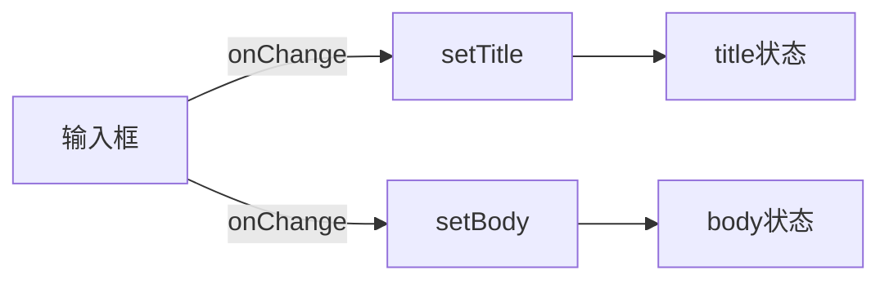
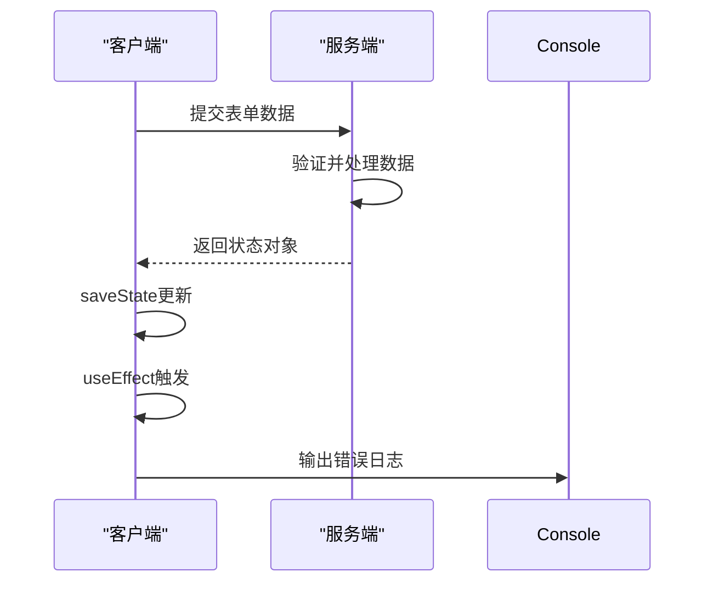
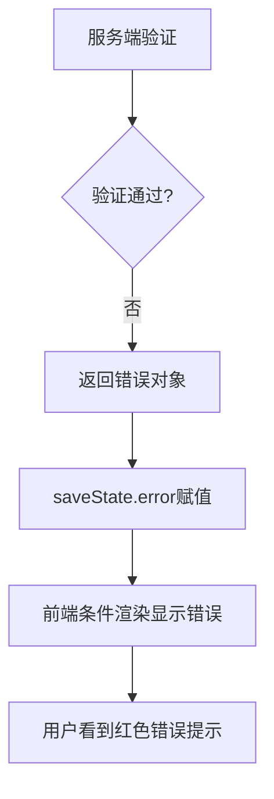
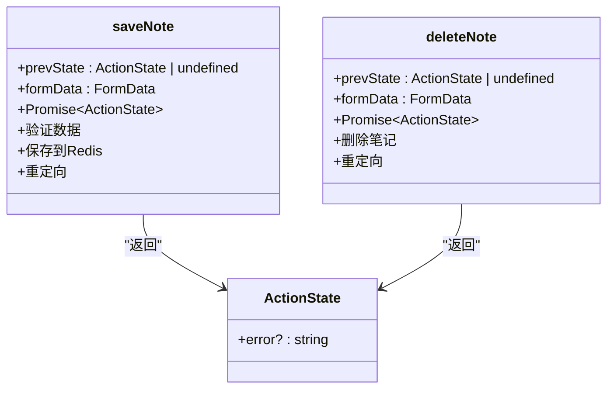

# 状态管理机制

<cite>
**Referenced Files in This Document**  
- [components/NoteEditor.tsx](file://components/NoteEditor.tsx)
- [app/[lng]/actions.ts](file://app/[lng]/actions.ts)
- [components/SaveButton.tsx](file://components/SaveButton.tsx)
- [components/DeleteButton.tsx](file://components/DeleteButton.tsx)
</cite>

## 目录
1. [简介](#简介)
2. [核心状态管理实现](#核心状态管理实现)
3. [表单交互与状态流转](#表单交互与状态流转)
4. [客户端与服务端状态协同](#客户端与服务端状态协同)
5. [错误处理与用户反馈](#错误处理与用户反馈)
6. [组件间数据传递机制](#组件间数据传递机制)

## 简介
本文档深入解析blessed项目中基于`useActionState`的状态管理实现。重点分析NoteEditor组件如何通过该Hook管理笔记的保存与删除操作，阐述客户端状态与服务端动作的协同机制。

## 核心状态管理实现

NoteEditor组件通过React的`useActionState` Hook实现了对两个Server Actions（`saveNote`和`deleteNote`）的状态管理。该Hook为每个服务端操作返回一个三元组：[状态, 操作函数, pending标志]。

在组件初始化时，通过以下方式绑定服务端动作：

```mermaid
flowchart TD
A[NoteEditor组件] --> B[useActionState(saveNote)]
A --> C[useActionState(deleteNote)]
B --> D[saveState: 保存状态]
B --> E[saveFormAction: 保存操作函数]
B --> F[isSaving: 保存中标志]
C --> G[deleteState: 删除状态]
C --> H[deleteFormAction: 删除操作函数]
C --> I[isDeleting: 删除中标志]
```

**Diagram sources**  
- [components/NoteEditor.tsx](file://components/NoteEditor.tsx#L10-L20)

**Section sources**  
- [components/NoteEditor.tsx](file://components/NoteEditor.tsx#L10-L20)

## 表单交互与状态流转

### 本地状态同步
表单的输入状态通过`useState`进行本地管理，确保用户输入的实时响应：



### 提交状态控制
通过`isSaving`和`isDeleting`标志控制按钮的加载状态和禁用状态，防止重复提交：

```mermaid
flowchart TD
Start[用户点击保存] --> Check[isSaving?]
Check --> |是| Disable[禁用按钮显示"Saving..."]
Check --> |否| Enable[启用按钮显示"Done"]
Disable --> Submit[提交表单]
Submit --> End[等待响应]
```

**Diagram sources**  
- [components/NoteEditor.tsx](file://components/NoteEditor.tsx#L22-L25)
- [components/SaveButton.tsx](file://components/SaveButton.tsx#L10-L20)
- [components/DeleteButton.tsx](file://components/DeleteButton.tsx#L10-L20)

**Section sources**  
- [components/NoteEditor.tsx](file://components/NoteEditor.tsx#L22-L25)
- [components/SaveButton.tsx](file://components/SaveButton.tsx#L1-L27)
- [components/DeleteButton.tsx](file://components/DeleteButton.tsx#L1-L26)

## 客户端与服务端状态协同

### 数据传递机制
表单通过隐藏的input字段将本地状态传递给Server Action：

```html
<input type="hidden" name="noteId" value={noteId || ""} />
<input type="hidden" name="title" value={title} />
<input type="hidden" name="body" value={body} />
```

这些隐藏字段与`formAction`结合，确保服务端能够接收到最新的表单数据。

### 状态监听与日志
使用`useEffect`监听`saveState`的变化，实现客户端与服务端状态的同步：



**Diagram sources**  
- [components/NoteEditor.tsx](file://components/NoteEditor.tsx#L26-L30)

**Section sources**  
- [components/NoteEditor.tsx](file://components/NoteEditor.tsx#L26-L30)

## 错误处理与用户反馈

### 服务端验证错误捕获
当服务端验证失败时，通过`saveState?.error`捕获并显示错误信息：



服务端使用zod进行数据验证，返回具体的错误消息：

```typescript
const schema = z.object({
  title: z.string().trim().min(1, "请填写标题"),
  content: z.string().min(1, "请填写内容").max(100, "字数最多 100"),
});
```

**Diagram sources**  
- [app/[lng]/actions.ts](file://app/[lng]/actions.ts#L12-L16)
- [components/NoteEditor.tsx](file://components/NoteEditor.tsx#L70-L75)

**Section sources**  
- [app/[lng]/actions.ts](file://app/[lng]/actions.ts#L12-L16)
- [components/NoteEditor.tsx](file://components/NoteEditor.tsx#L70-L75)

## 组件间数据传递机制

### Server Actions定义
服务端动作在`actions.ts`中定义，接收`FormData`并返回状态对象：



**Diagram sources**  
- [app/[lng]/actions.ts](file://app/[lng]/actions.ts#L18-L74)

**Section sources**  
- [app/[lng]/actions.ts](file://app/[lng]/actions.ts#L18-L74)