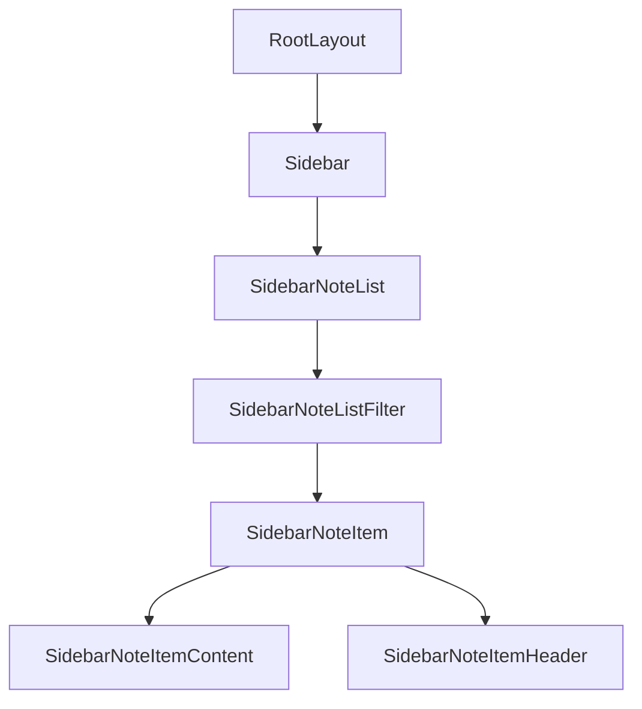
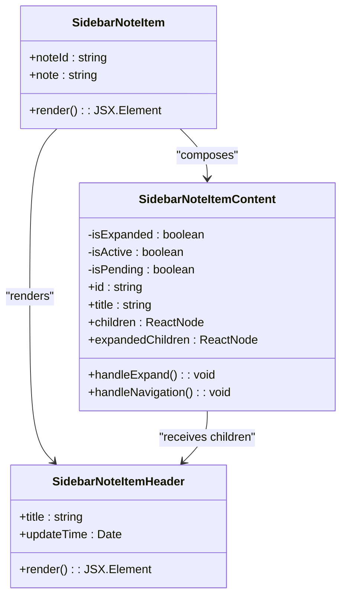

# 组件树结构

<cite>
**Referenced Files in This Document**   
- [layout.tsx](file://app/[lng]/layout.tsx)
- [Sidebar.tsx](file://components/Sidebar.tsx)
- [SidebarNoteList.tsx](file://components/SidebarNoteList.tsx)
- [SidebarNoteItem.tsx](file://components/SidebarNoteItem.tsx)
- [SidebarNoteItemHeader.tsx](file://components/SidebarNoteItemHeader.tsx)
- [SidebarNoteItemContent.tsx](file://components/SidebarNoteItemContent.tsx)
- [SidebarNoteListFilter.tsx](file://components/SidebarNoteListFilter.tsx)
</cite>

## 组件层级关系概述

本项目采用嵌套式组件架构，构建了一个清晰的前端组件树结构。从根布局到具体笔记项，组件通过props逐层传递数据与行为，形成`RootLayout → Sidebar → SidebarNoteList → SidebarNoteItem → SidebarNoteItemHeader/SidebarNoteItemContent`的完整渲染链条。该结构实现了关注点分离，提升了组件复用性与可维护性。

**Diagram sources**
- [layout.tsx](file://app/[lng]/layout.tsx#L19-L38)
- [Sidebar.tsx](file://components/Sidebar.tsx#L9-L39)
- [SidebarNoteList.tsx](file://components/SidebarNoteList.tsx#L4-L28)
- [SidebarNoteItem.tsx](file://components/SidebarNoteItem.tsx#L4-L26)
- [SidebarNoteItemHeader.tsx](file://components/SidebarNoteItemHeader.tsx#L7-L17)
- [SidebarNoteItemContent.tsx](file://components/SidebarNoteItemContent.tsx#L1-L100)

## RootLayout 根布局组件

`RootLayout`作为应用的根布局组件，定义了整体页面结构。它接收`children`属性作为主内容区域的占位符，并通过`params.lng`获取当前语言环境。该组件将`Sidebar`与`children`并列渲染于容器内，实现侧边栏与主视图的布局分离。`children`的具体内容由不同路由下的页面组件填充，体现了Next.js的布局嵌套机制。

**Section sources**
- [layout.tsx](file://app/[lng]/layout.tsx#L19-L38)

## Sidebar 侧边栏组件

`Sidebar`组件接收`lng`参数以支持国际化文本渲染。其结构包含Logo标题、搜索框`SidebarSearchField`、新建按钮`EditButton`以及核心的笔记列表区域。笔记列表通过`Suspense`组件包裹`SidebarNoteList`，实现异步加载时的骨架屏占位（`NoteListSkeleton`），提升了用户体验。这种设计将UI加载状态与数据获取逻辑解耦。

**Section sources**
- [Sidebar.tsx](file://components/Sidebar.tsx#L9-L39)

## SidebarNoteList 笔记列表组件

`SidebarNoteList`作为服务端组件，负责从Redis数据源获取所有笔记数据。它调用`getAllNotes()`异步函数获取笔记集合，并将原始数据转换为包含`noteId`、解析后的笔记对象及预渲染的`header` JSX元素的对象数组。当无笔记时显示空状态提示；否则将数据传递给客户端组件`SidebarNoteListFilter`进行筛选处理。

**Section sources**
- [SidebarNoteList.tsx](file://components/SidebarNoteList.tsx#L4-L28)

## SidebarNoteItem 笔记项组件

`SidebarNoteItem`接收单个笔记的`noteId`和序列化笔记数据作为props。它解析笔记内容后，将标题和更新时间传递给`SidebarNoteItemHeader`，并将内容摘要作为`expandedChildren`传递给`SidebarNoteItemContent`。该组件作为中间层，协调了数据解析与UI渲染的职责分离。

**Section sources**
- [SidebarNoteItem.tsx](file://components/SidebarNoteItem.tsx#L4-L26)

## SidebarNoteItem 子组件职责分离

### SidebarNoteItemHeader
该组件专注于渲染笔记项的头部信息，包括标题和格式化后的时间戳。它接收`title`和`updateTime`作为props，使用`dayjs`库进行日期格式化，确保时间显示的一致性。

### SidebarNoteItemContent
作为客户端组件，`SidebarNoteItemContent`管理笔记项的交互状态，如展开/折叠、选中高亮和路由跳转。它通过`useRouter`和`usePathname`监听路由变化，并利用`useTransition`处理导航时的pending状态。组件通过`ref`和`useEffect`实现标题编辑后的闪光动画效果，增强了用户反馈。

**Diagram sources**
- [SidebarNoteItem.tsx](file://components/SidebarNoteItem.tsx#L4-L26)
- [SidebarNoteItemHeader.tsx](file://components/SidebarNoteItemHeader.tsx#L7-L17)
- [SidebarNoteItemContent.tsx](file://components/SidebarNoteItemContent.tsx#L1-L100)

**Section sources**
- [SidebarNoteItemHeader.tsx](file://components/SidebarNoteItemHeader.tsx#L7-L17)
- [SidebarNoteItemContent.tsx](file://components/SidebarNoteItemContent.tsx#L1-L100)

## 异步组件加载与数据流

组件树结合了服务端与客户端组件的优势：`SidebarNoteList`在服务端获取数据并预处理，减少客户端请求；`SidebarNoteListFilter`和`SidebarNoteItemContent`作为客户端组件处理用户交互。`Suspense`边界确保在数据加载完成前显示骨架屏，避免了界面闪烁。数据通过props自上而下流动，从`SidebarNoteList`经`SidebarNoteListFilter`最终传递至每个`SidebarNoteItem`，形成了清晰的数据流管道。

**Section sources**
- [SidebarNoteList.tsx](file://components/SidebarNoteList.tsx#L4-L28)
- [SidebarNoteListFilter.tsx](file://components/SidebarNoteListFilter.tsx#L1-L48)
- [SidebarNoteItem.tsx](file://components/SidebarNoteItem.tsx#L4-L26)