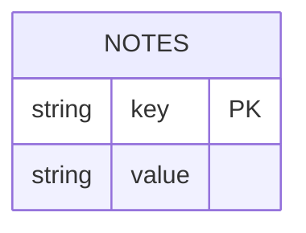
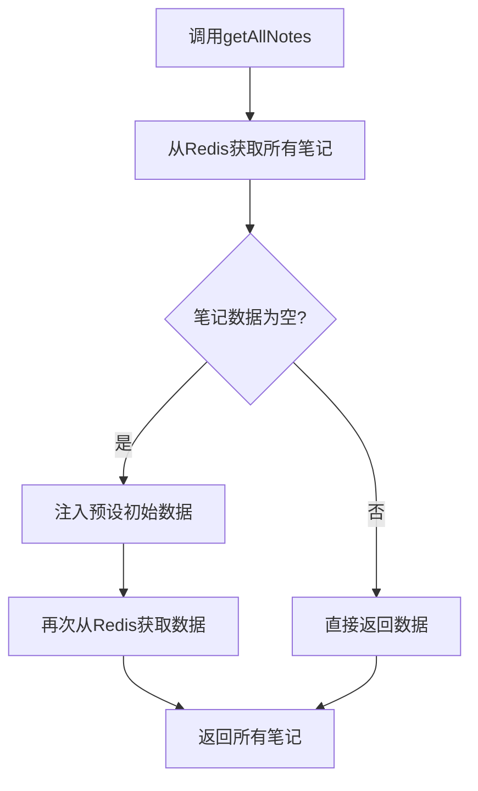
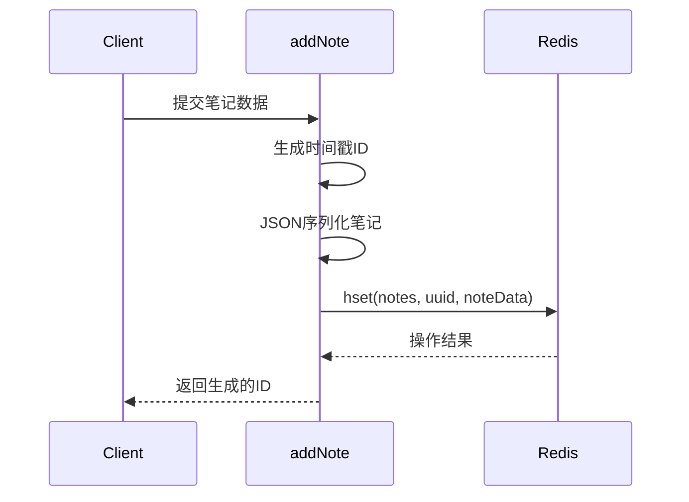
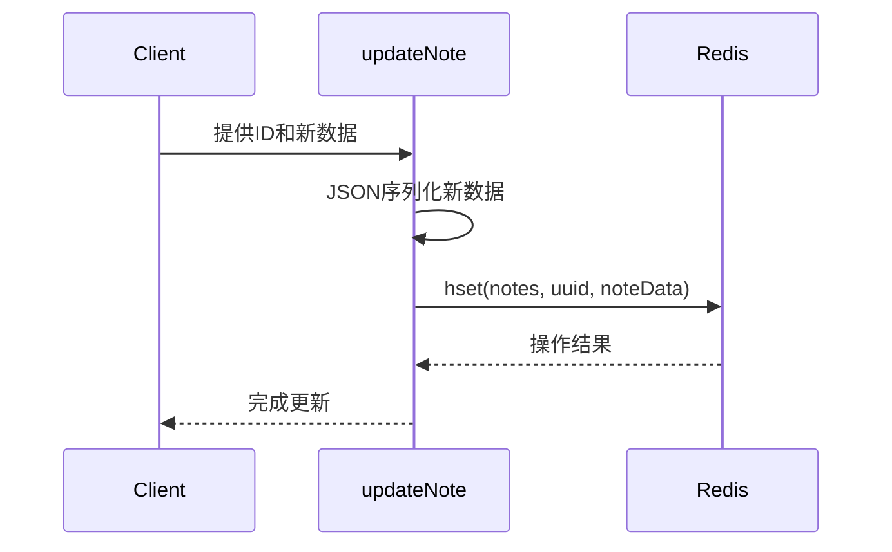
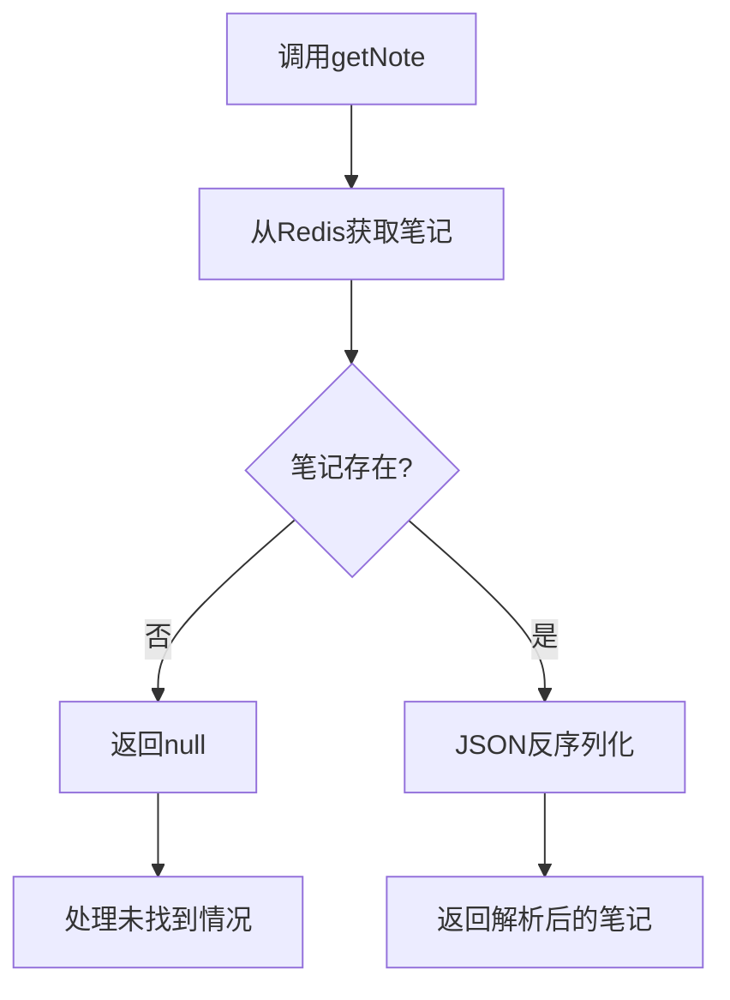
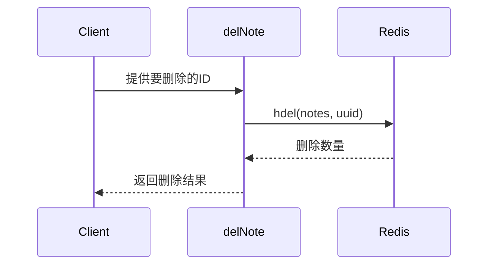

# Redis数据访问层

<cite>
**Referenced Files in This Document**  
- [redis.ts](file://lib/redis.ts)
- [types.ts](file://lib/types.ts)
</cite>

## 目录
1. [简介](#简介)
2. [核心功能概览](#核心功能概览)
3. [Redis哈希结构设计](#redis哈希结构设计)
4. [核心函数实现分析](#核心函数实现分析)
5. [数据序列化与反序列化](#数据序列化与反序列化)
6. [连接管理与异常处理](#连接管理与异常处理)
7. [改进建议](#改进建议)

## 简介
本文档详细描述了blessed项目中基于Redis的笔记数据访问层实现。该层提供了对笔记数据的增删改查（CRUD）操作，利用Redis哈希结构高效存储和检索笔记信息。文档重点分析了`getAllNotes`、`addNote`、`updateNote`、`getNote`和`delNote`五个核心函数的实现机制，以及相关的数据结构设计和最佳实践。

## 核心功能概览
数据访问层提供以下核心功能：
- `getAllNotes`: 获取所有笔记
- `addNote`: 添加新笔记
- `updateNote`: 更新现有笔记
- `getNote`: 获取单个笔记
- `delNote`: 删除笔记

这些函数共同构成了应用与Redis数据库之间的交互接口，确保了笔记数据的持久化存储和高效访问。

## Redis哈希结构设计
系统采用Redis哈希（hash）结构来存储笔记数据，具有以下设计特点：

**设计要点**：
- **键名**：统一使用`notes`作为哈希结构的键名
- **字段**：使用唯一ID作为哈希字段，当前实现中为时间戳字符串
- **值**：存储JSON序列化的笔记对象字符串
- **数据模型**：符合Redis哈希结构的键值对存储模式，适合存储对象集合

**Diagram sources**
- [redis.ts](file://lib/redis.ts#L1-L46)

**Section sources**
- [redis.ts](file://lib/redis.ts#L1-L46)

## 核心函数实现分析

### getAllNotes函数
`getAllNotes`函数负责获取所有存储在Redis中的笔记数据。

该函数实现了智能初始化逻辑：当检测到Redis中无笔记数据时，自动注入预设的初始笔记集合，确保应用始终有可用数据。

**Diagram sources**
- [redis.ts](file://lib/redis.ts#L14-L20)

**Section sources**
- [redis.ts](file://lib/redis.ts#L14-L20)

### addNote函数
`addNote`函数用于添加新的笔记记录。

**ID生成策略**：
- 使用`Date.now().toString()`生成唯一ID
- 基于当前时间戳，确保全局唯一性
- 简单高效，无需额外依赖

**局限性**：
- 在极高并发场景下可能存在ID冲突风险
- 时间戳精度限制（毫秒级）
- 无法保证严格的顺序性

**Diagram sources**
- [redis.ts](file://lib/redis.ts#L22-L27)

**Section sources**
- [redis.ts](file://lib/redis.ts#L22-L27)

### updateNote函数
`updateNote`函数实现笔记的更新操作。

该函数采用同键更新策略：无论指定ID的笔记是否存在，都直接执行`hset`操作。如果笔记已存在，则更新其内容；如果不存在，则创建新笔记。这种设计简化了逻辑处理，但需注意可能掩盖某些错误场景。

**Diagram sources**
- [redis.ts](file://lib/redis.ts#L29-L32)

**Section sources**
- [redis.ts](file://lib/redis.ts#L29-L32)

### getNote函数
`getNote`函数用于获取指定ID的单个笔记。

该函数实现了安全的获取逻辑，包含存在性检查和异常处理，确保不会因无效ID导致程序崩溃。

**Diagram sources**
- [redis.ts](file://lib/redis.ts#L34-L38)

**Section sources**
- [redis.ts](file://lib/redis.ts#L34-L38)

### delNote函数
`delNote`函数负责删除指定ID的笔记。

该函数直接调用Redis的`hdel`命令删除指定字段，返回删除的字段数量，便于调用方判断操作结果。

**Diagram sources**
- [redis.ts](file://lib/redis.ts#L40-L42)

**Section sources**
- [redis.ts](file://lib/redis.ts#L40-L42)

## 数据序列化与反序列化
系统在存储和读取笔记时进行JSON序列化与反序列化处理。

### 序列化过程
- 使用`JSON.stringify()`将`NoteData`对象转换为字符串
- 存储格式：`{"title":"...","content":"...","updateTime":"..."}`

### 反序列化过程
- 使用`JSON.parse()`将字符串转换回对象
- 类型断言：`as NoteData`确保类型安全

### 潜在风险
- **日期对象解析问题**：`JSON.parse()`会将日期字符串转换为普通字符串，而非`Date`对象
- **类型安全风险**：反序列化后需要进行类型验证
- **数据完整性风险**：网络传输或存储过程中可能损坏JSON格式

**Section sources**
- [redis.ts](file://lib/redis.ts#L24-L26)
- [types.ts](file://lib/types.ts#L1-L5)

## 连接管理与异常处理
数据访问层通过以下机制确保连接稳定性和错误处理：

### 连接管理
- 使用单例模式创建Redis连接实例
- 连接复用，避免频繁创建销毁连接
- 全局导出`redis`实例供其他模块使用

### 异常处理
- 函数返回Promise，支持异步错误处理
- 依赖Redis客户端的内置错误处理机制
- 调用方需处理可能的网络异常和操作失败

**Section sources**
- [redis.ts](file://lib/redis.ts#L3-L5)

## 改进建议
针对当前实现，提出以下改进建议：

### ID生成策略优化
- 考虑使用更可靠的唯一ID生成算法（如UUID）
- 或在时间戳基础上添加随机后缀以降低冲突概率
- 实现ID存在性检查，避免意外覆盖

### 数据完整性增强
- 添加数据验证层，确保存取数据的结构完整性
- 实现自定义序列化/反序列化逻辑，正确处理日期对象
- 添加校验和或版本号，确保数据一致性

### 错误处理完善
- 添加更详细的错误类型区分
- 实现重试机制应对临时性网络故障
- 添加连接健康检查和自动重连功能

### 性能优化
- 考虑使用Redis管道（pipeline）批量操作
- 实现客户端缓存减少重复查询
- 添加操作耗时监控和性能分析

这些改进将提升系统的可靠性、安全性和性能表现。