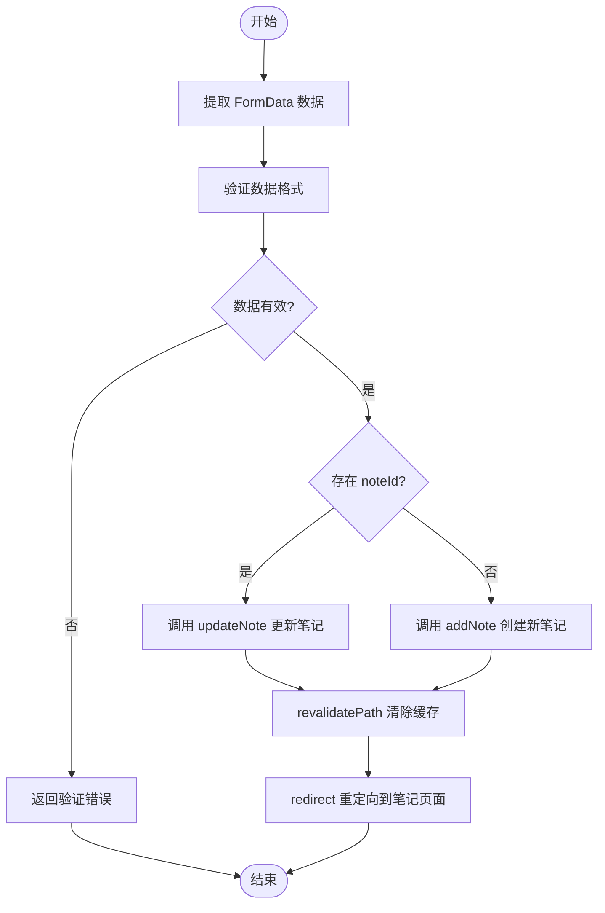
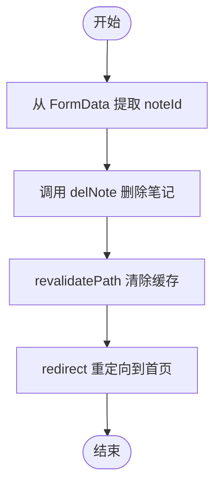
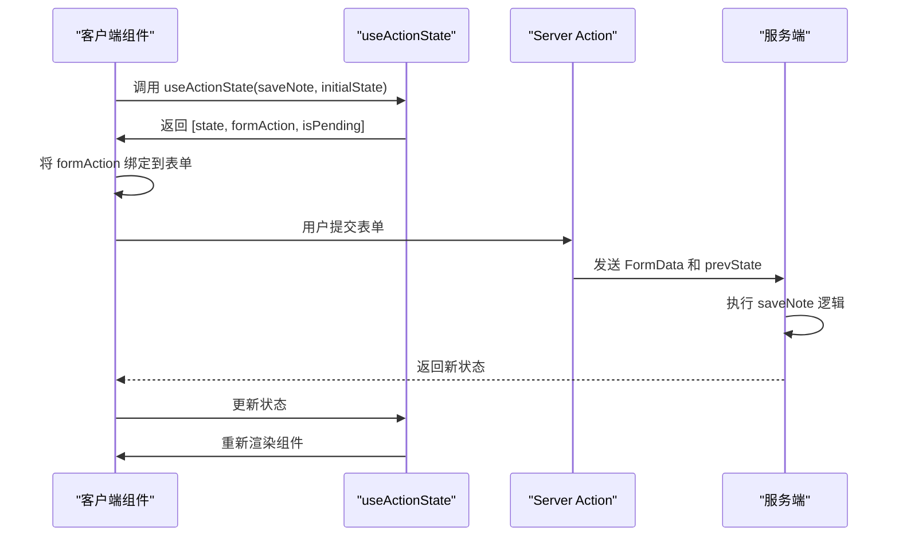
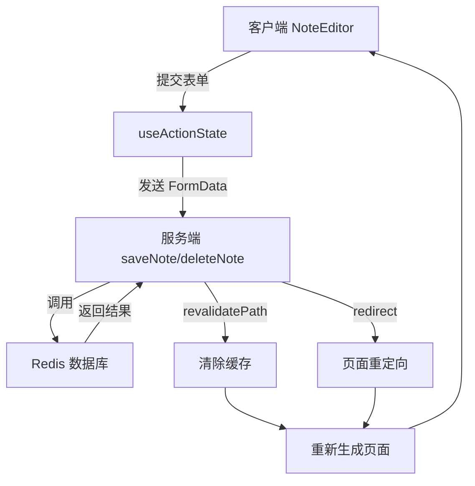

# Server Actions

<cite>
**Referenced Files in This Document**  
- [actions.ts](file://app/[lng]/actions.ts)
- [NoteEditor.tsx](file://components/NoteEditor.tsx)
- [redis.ts](file://lib/redis.ts)
- [page.tsx](file://app/[lng]/note/edit/[id]/page.tsx)
</cite>

## 目录
1. [简介](#简介)
2. [核心服务端操作函数](#核心服务端操作函数)
3. [客户端集成与使用](#客户端集成与使用)
4. [错误处理与验证机制](#错误处理与验证机制)
5. [缓存与重定向](#缓存与重定向)
6. [架构与数据流](#架构与数据流)
7. [总结](#总结)

## 简介
Server Actions 是 Next.js 提供的一种在服务端执行数据操作的现代化方式，它允许开发者直接从客户端组件调用服务端函数，而无需构建传统的 REST API。本文档聚焦于 `blessed` 项目中的 `saveNote` 和 `deleteNote` 两个核心服务端操作函数，详细阐述其工作原理、实现细节以及与 React Server Components 的无缝集成方式。

**Section sources**
- [actions.ts](file://app/[lng]/actions.ts#L1-L75)

## 核心服务端操作函数

### saveNote 函数
`saveNote` 函数是处理笔记创建与更新的核心服务端操作。该函数通过 `'use server'` 指令声明，确保其在服务端执行。它接收来自客户端表单的 `FormData` 数据和一个可选的先前状态对象。

函数首先从 `FormData` 中提取 `noteId`、`title` 和 `body`。如果 `noteId` 存在，则判定为更新现有笔记，调用 `updateNote` 函数；如果 `noteId` 不存在，则判定为创建新笔记，调用 `addNote` 函数并获取新生成的 ID。

**Diagram sources**
- [actions.ts](file://app/[lng]/actions.ts#L18-L56)

**Section sources**
- [actions.ts](file://app/[lng]/actions.ts#L18-L56)

### deleteNote 函数
`deleteNote` 函数负责安全地删除笔记记录。它同样通过 `'use server'` 指令在服务端执行，接收 `FormData` 和先前状态。

函数从 `FormData` 中提取 `noteId`，然后调用 `delNote` 函数从 Redis 数据库中删除对应的笔记。操作成功后，清除相关缓存并重定向用户至首页。

**Diagram sources**
- [actions.ts](file://app/[lng]/actions.ts#L58-L74)

**Section sources**
- [actions.ts](file://app/[lng]/actions.ts#L58-L74)

## 客户端集成与使用

### 与 React Server Components 集成
Server Actions 与 React Server Components (RSC) 无缝集成，实现了从客户端到服务端的直连调用。在 `NoteEditor` 组件中，通过导入 `saveNote` 和 `deleteNote` 函数，可以直接在客户端使用它们，而无需手动编写 fetch 请求。

### 使用 useActionState
客户端通过 `useActionState` Hook 来绑定和管理 Server Actions 的状态。该 Hook 接收服务端操作函数和初始状态，返回一个包含当前状态、绑定后的操作函数和挂起状态的元组。

在 `NoteEditor` 组件中，`useActionState(saveNote, undefined)` 创建了 `saveFormAction`，该函数可以直接绑定到表单的 `action` 属性上。当表单提交时，`saveFormAction` 会被触发，执行服务端的 `saveNote` 逻辑。

**Diagram sources**
- [NoteEditor.tsx](file://components/NoteEditor.tsx#L1-L92)

**Section sources**
- [NoteEditor.tsx](file://components/NoteEditor.tsx#L1-L92)

## 错误处理与验证机制

### Zod 验证
`saveNote` 函数使用 Zod 库对输入数据进行严格验证。定义了一个包含 `title` 和 `content` 字段的 schema，确保标题不为空，内容长度在 1 到 100 个字符之间。

当验证失败时，函数会捕获 `validated.error.issues` 数组中的第一个错误信息，并将其作为 `error` 字段返回给客户端。

### 错误反馈流程
客户端组件监听 `useActionState` 返回的状态对象。如果 `saveState?.error` 或 `deleteState?.error` 存在，组件会渲染一个红色的错误提示信息，向用户反馈操作失败的原因。

**Section sources**
- [actions.ts](file://app/[lng]/actions.ts#L12-L16)
- [NoteEditor.tsx](file://components/NoteEditor.tsx#L25-L28)

## 缓存与重定向

### revalidatePath
为了确保用户界面显示最新数据，`saveNote` 和 `deleteNote` 函数在成功操作后都会调用 `revalidatePath("/", "layout")`。这会清除指定路径的缓存，强制 Next.js 在下次请求时重新生成页面，从而反映最新的笔记列表。

### redirect
两个操作函数在完成数据处理后，都使用 `redirect` 函数将用户重定向到新页面。`saveNote` 重定向到新创建或更新的笔记页面，而 `deleteNote` 重定向到首页。`redirect` 会抛出一个特殊的异常来中断函数执行并触发重定向。

**Section sources**
- [actions.ts](file://app/[lng]/actions.ts#L53-L54)
- [actions.ts](file://app/[lng]/actions.ts#L72-L73)

## 架构与数据流

### 数据流分析
整个笔记应用的数据流清晰高效。用户在客户端 `NoteEditor` 中编辑内容，提交表单后，`useActionState` 绑定的 `formAction` 会将 `FormData` 发送到服务端的 `saveNote` 或 `deleteNote` 函数。服务端函数处理数据、与 Redis 交互、验证并更新状态，最后通过 `revalidatePath` 和 `redirect` 控制页面更新和导航。

**Diagram sources**
- [actions.ts](file://app/[lng]/actions.ts#L18-L74)
- [NoteEditor.tsx](file://components/NoteEditor.tsx#L1-L92)
- [redis.ts](file://lib/redis.ts#L1-L45)

**Section sources**
- [actions.ts](file://app/[lng]/actions.ts#L1-L75)
- [NoteEditor.tsx](file://components/NoteEditor.tsx#L1-L92)
- [redis.ts](file://lib/redis.ts#L1-L45)

## 总结
`blessed` 项目中的 Server Actions 实现了现代化的全栈数据操作模式。通过 `saveNote` 和 `deleteNote` 函数，项目展示了如何利用 `'use server'` 指令、`FormData`、`useActionState`、Zod 验证、`revalidatePath` 和 `redirect` 等技术，构建高效、安全且用户体验良好的笔记应用。这种模式简化了前后端通信，减少了样板代码，并与 React Server Components 深度集成，代表了 Next.js 应用开发的最佳实践。

**Section sources**
- [actions.ts](file://app/[lng]/actions.ts#L1-L75)
- [NoteEditor.tsx](file://components/NoteEditor.tsx#L1-L92)
- [redis.ts](file://lib/redis.ts#L1-L45)
- [page.tsx](file://app/[lng]/note/edit/[id]/page.tsx#L1-L30)