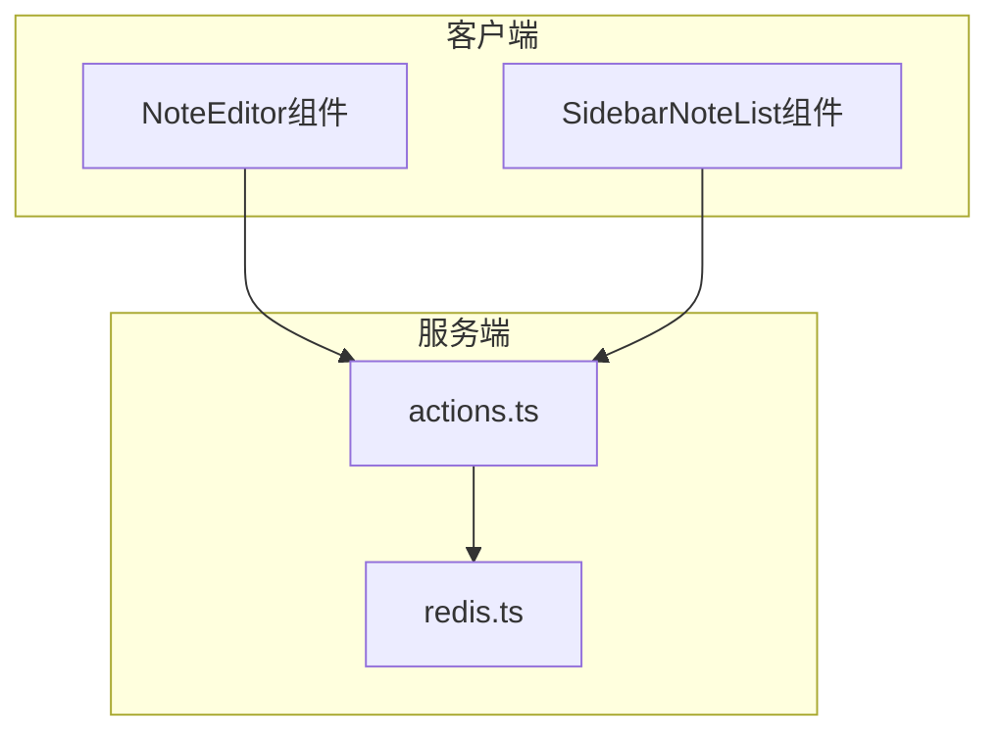
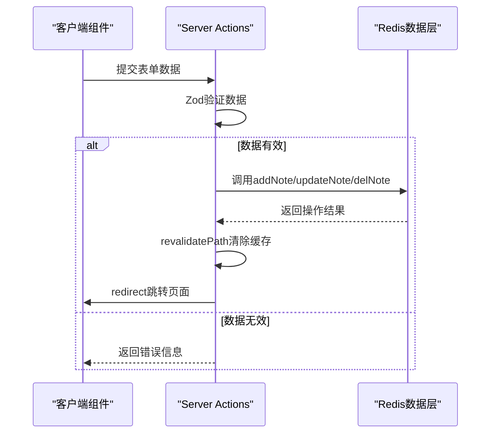
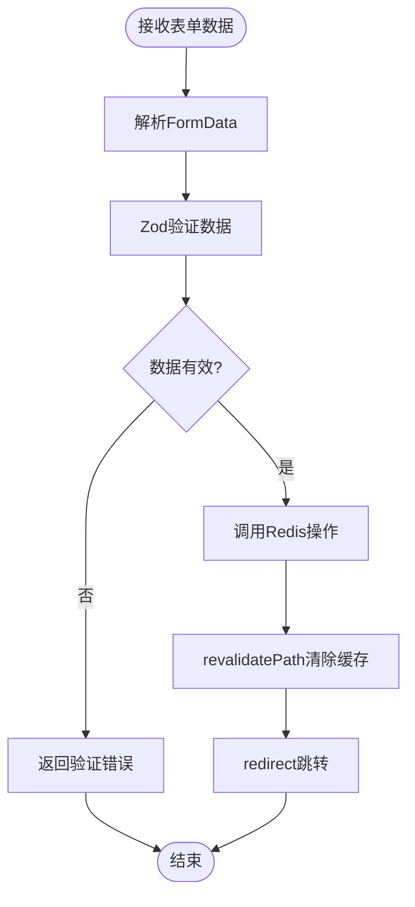
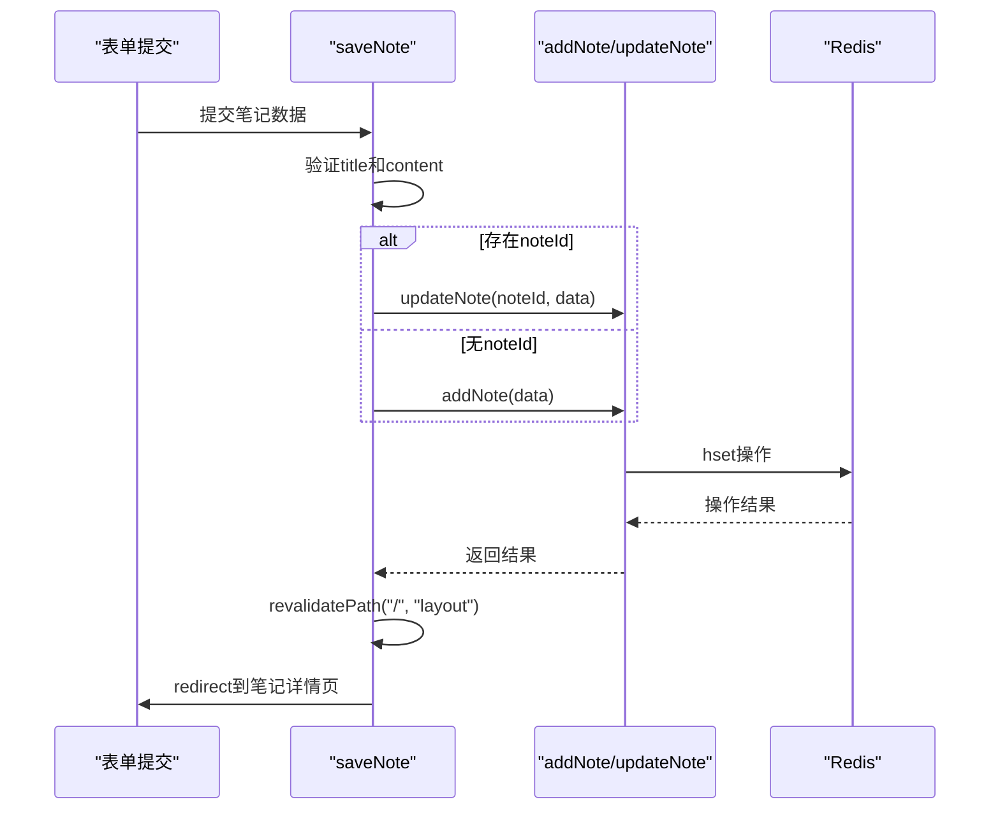
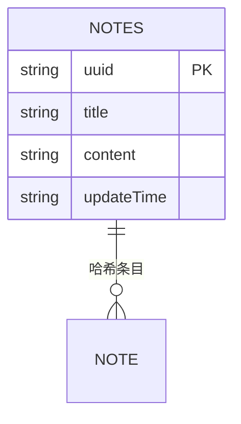
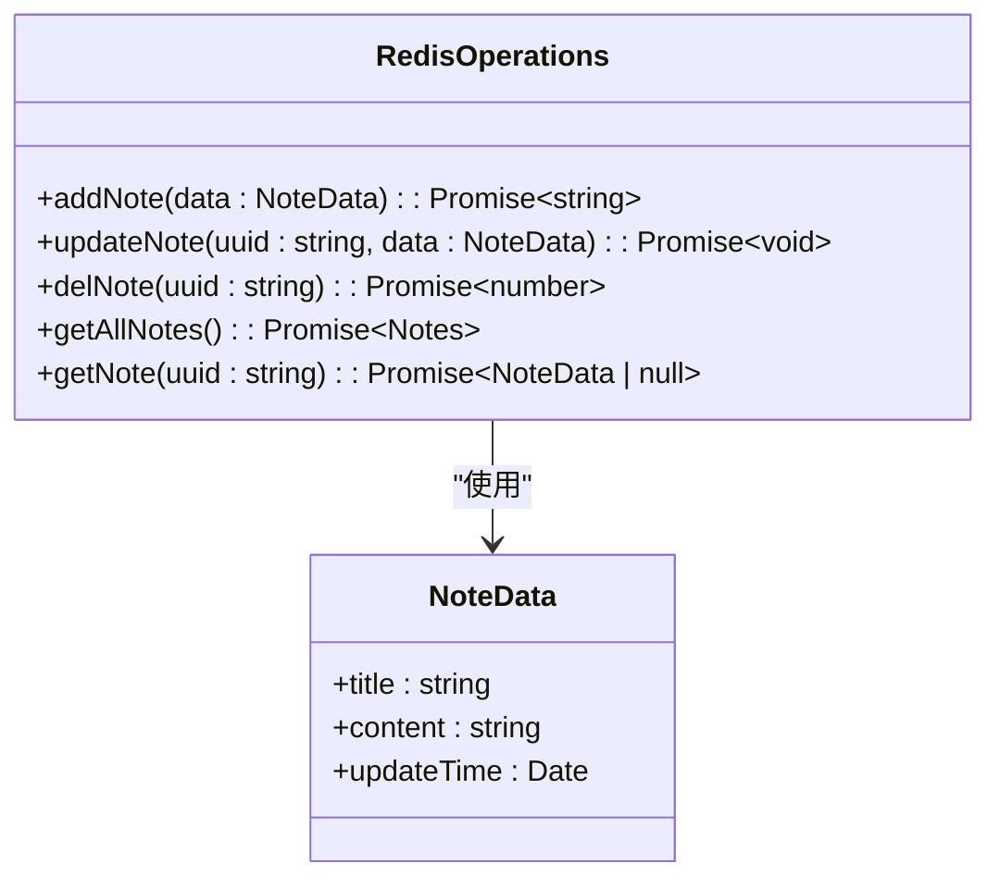
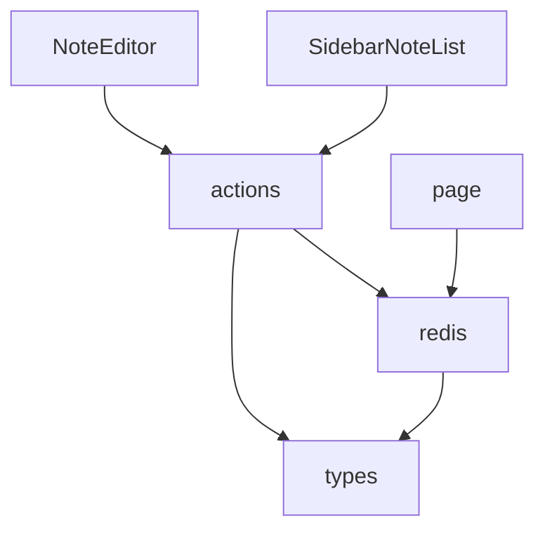

# 后端架构

<cite>
**本文档引用的文件**  
- [actions.ts](file://app/[lng]/actions.ts)
- [redis.ts](file://lib/redis.ts)
- [types.ts](file://lib/types.ts)
- [NoteEditor.tsx](file://components/NoteEditor.tsx)
- [SidebarNoteList.tsx](file://components/SidebarNoteList.tsx)
- [page.tsx](file://app/[lng]/note/[id]/page.tsx)
</cite>

## 目录
1. [简介](#简介)
2. [项目结构](#项目结构)
3. [核心组件](#核心组件)
4. [架构概览](#架构概览)
5. [详细组件分析](#详细组件分析)
6. [依赖分析](#依赖分析)
7. [性能考虑](#性能考虑)
8. [故障排除指南](#故障排除指南)
9. [结论](#结论)

## 简介
本项目采用Next.js Server Actions作为核心后端交互机制，替代传统API路由，实现更简洁的服务端逻辑处理。通过`actions.ts`中的`saveNote`和`deleteNote`函数接收表单数据，结合Zod进行数据验证，并调用Redis数据层完成增删改查操作。系统利用`revalidatePath`实现缓存自动清除，`redirect`完成页面跳转，形成完整的数据流闭环。

## 项目结构
项目采用标准Next.js App Router结构，核心服务端逻辑集中在`app/[lng]/actions.ts`，数据访问封装于`lib/redis.ts`。组件与服务端动作通过`useActionState`进行绑定，实现声明式数据交互。

**Diagram sources**  
- [actions.ts](file://app/[lng]/actions.ts#L1-L75)
- [redis.ts](file://lib/redis.ts#L1-L45)

**Section sources**  
- [actions.ts](file://app/[lng]/actions.ts#L1-L75)
- [redis.ts](file://lib/redis.ts#L1-L45)

## 核心组件
`actions.ts`中的`saveNote`和`deleteNote`函数作为服务端入口，接收客户端表单数据并执行完整业务逻辑。`redis.ts`提供统一的数据访问接口，封装Redis操作细节。`types.ts`定义了`NoteData`和`Notes`等核心数据结构，确保类型安全。

**Section sources**  
- [actions.ts](file://app/[lng]/actions.ts#L18-L56)
- [redis.ts](file://lib/redis.ts#L22-L32)
- [types.ts](file://lib/types.ts#L1-L30)

## 架构概览
系统采用Server Actions驱动的数据流架构，客户端组件通过表单直接调用服务端函数，无需中间API层。数据验证、持久化、缓存更新和页面跳转均在服务端动作中完成。

**Diagram sources**  
- [actions.ts](file://app/[lng]/actions.ts#L18-L56)
- [redis.ts](file://lib/redis.ts#L22-L42)

## 详细组件分析

### Server Actions 分析
`saveNote`和`deleteNote`作为Server Actions，直接处理表单提交，实现从用户输入到数据持久化的完整流程。

#### 数据验证流程

**Diagram sources**  
- [actions.ts](file://app/[lng]/actions.ts#L18-L56)
- [types.ts](file://lib/types.ts#L1-L10)

#### 服务端动作调用链

**Diagram sources**  
- [actions.ts](file://app/[lng]/actions.ts#L18-L56)
- [redis.ts](file://lib/redis.ts#L22-L32)

### Redis 数据层分析
Redis作为数据存储层，采用哈希结构存储笔记数据，每个笔记以UUID为键，JSON序列化对象为值。

#### 数据存储结构

**Diagram sources**  
- [redis.ts](file://lib/redis.ts#L10-L15)
- [types.ts](file://lib/types.ts#L1-L10)

#### Redis 操作实现

**Diagram sources**  
- [redis.ts](file://lib/redis.ts#L22-L42)
- [types.ts](file://lib/types.ts#L1-L10)

**Section sources**  
- [redis.ts](file://lib/redis.ts#L22-L42)
- [types.ts](file://lib/types.ts#L1-L10)

## 依赖分析
系统依赖关系清晰，客户端组件依赖Server Actions，Server Actions依赖Redis数据访问层。类型定义独立于业务逻辑，被多处引用。

**Diagram sources**  
- [actions.ts](file://app/[lng]/actions.ts#L4-L5)
- [redis.ts](file://lib/redis.ts#L2-L3)
- [types.ts](file://lib/types.ts#L1-L2)

**Section sources**  
- [actions.ts](file://app/[lng]/actions.ts#L1-L75)
- [redis.ts](file://lib/redis.ts#L1-L45)
- [types.ts](file://lib/types.ts#L1-L30)

## 性能考虑
- **缓存策略**：通过`revalidatePath("/", "layout")`在数据变更后清除布局缓存，确保侧边栏笔记列表实时更新
- **数据序列化**：使用JSON.stringify将笔记对象序列化存储，平衡存储效率与可读性
- **连接管理**：Redis实例全局单例，避免重复连接开销
- **初始数据**：内置默认笔记数据，提升首次加载体验

## 故障排除指南
- **表单提交无响应**：检查`useActionState`是否正确绑定`saveFormAction`
- **缓存未更新**：确认`revalidatePath`调用路径和缓存层级是否正确
- **Redis连接失败**：检查环境变量配置和网络连接
- **验证错误不显示**：确保客户端处理`ActionState`中的`error`字段
- **跳转失败**：确认`redirect`路径格式正确，且在服务端执行

**Section sources**  
- [actions.ts](file://app/[lng]/actions.ts#L30-L35)
- [NoteEditor.tsx](file://components/NoteEditor.tsx#L25-L30)

## 结论
本项目通过Server Actions实现了简洁高效的服务端交互架构，完全替代了传统API路由。数据流从客户端表单直达Redis存储，中间经过严格的Zod验证，配合Next.js的缓存和重定向机制，形成了完整、可靠的数据处理闭环。Redis作为轻量级数据存储，采用哈希结构和JSON序列化，既保证了性能又具备良好的可维护性。整体架构体现了现代全栈框架的简洁性与强大功能。