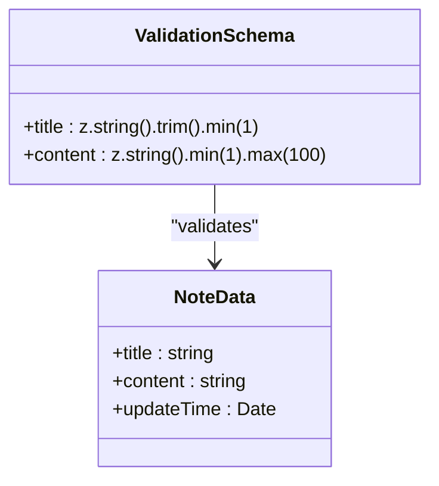
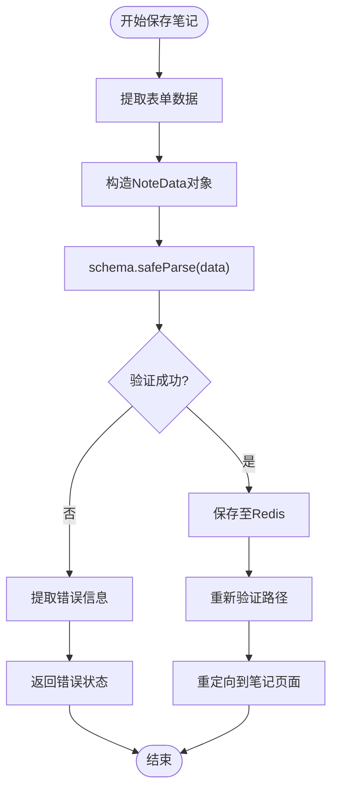
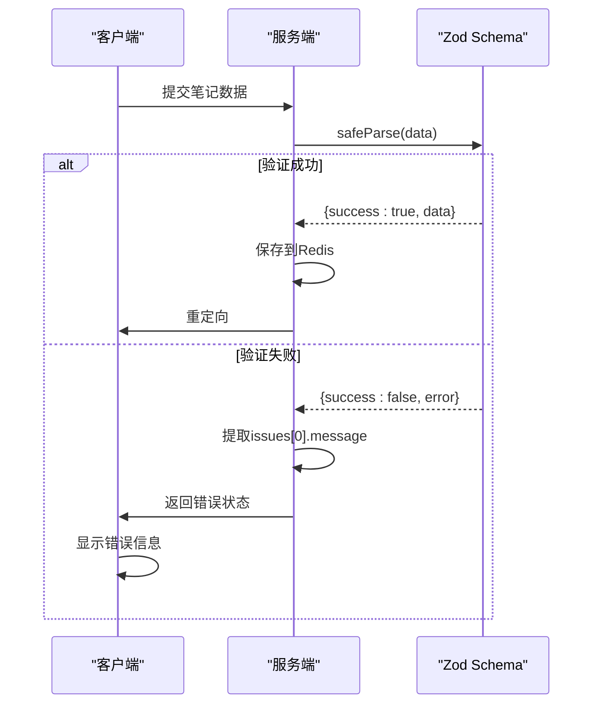

# 数据验证

<cite>
**Referenced Files in This Document**   
- [actions.ts](file://app/[lng]/actions.ts)
- [types.ts](file://lib/types.ts)
- [redis.ts](file://lib/redis.ts)
</cite>

## 目录
1. [简介](#简介)
2. [核心验证机制](#核心验证机制)
3. [Schema定义与规则](#schema定义与规则)
4. [验证流程分析](#验证流程分析)
5. [错误处理与用户反馈](#错误处理与用户反馈)
6. [服务端强类型校验优势](#服务端强类型校验优势)
7. [扩展验证规则示例](#扩展验证规则示例)
8. [服务端与客户端验证协同](#服务端与客户端验证协同)
9. [结论](#结论)

## 简介
本文档详细阐述了blessed项目中基于zod库的数据验证机制，重点分析`saveNote`函数如何通过schema对象对笔记数据进行服务端验证。文档涵盖验证规则定义、安全解析流程、错误信息提取以及防止非法数据写入Redis数据库的实现策略。

## 核心验证机制

blessed项目采用zod库在服务端实现数据验证，确保所有写入Redis数据库的笔记数据符合预定义的结构和约束条件。该机制通过`schema`对象定义数据模型，并利用`safeParse`方法进行非抛出式验证，有效防止了异常中断服务流程。

**Section sources**
- [actions.ts](file://app/[lng]/actions.ts#L13-L16)
- [actions.ts](file://app/[lng]/actions.ts#L18-L56)

## Schema定义与规则

验证规则通过zod的`z.object()`方法定义，针对笔记的标题和内容字段设置了明确的约束：

- **标题字段**：必须为字符串类型，经过`trim()`去除首尾空格，并通过`.min(1, "请填写标题")`确保非空
- **内容字段**：必须为字符串类型，通过`.min(1, "请填写内容")`保证非空，并通过`.max(100, "字数最多 100")`限制最大长度为100个字符

此schema确保了数据的完整性与合理性，防止空白或超长内容被存储。

**Diagram sources**
- [types.ts](file://lib/types.ts#L2-L7)
- [actions.ts](file://app/[lng]/actions.ts#L13-L16)

## 验证流程分析

`saveNote`函数执行时，首先从`FormData`中提取数据并构造`NoteData`对象，随后调用`schema.safeParse(data)`进行验证。`safeParse`方法返回一个包含`success`布尔值和`data`或`error`属性的结果对象，实现了安全的类型校验。

**Diagram sources**
- [actions.ts](file://app/[lng]/actions.ts#L18-L56)
- [redis.ts](file://lib/redis.ts#L20-L38)

**Section sources**
- [actions.ts](file://app/[lng]/actions.ts#L18-L56)

## 错误处理与用户反馈

当验证失败时，系统从`validated.error.issues`数组中提取第一条错误信息，并通过`message`属性获取用户友好的提示文本。这种设计确保了即使存在多个验证错误，也能向用户提供清晰、简洁的反馈，避免信息过载。

**Diagram sources**
- [actions.ts](file://app/[lng]/actions.ts#L40-L45)
- [NoteEditor.tsx](file://components/NoteEditor.tsx#L74-L77)

## 服务端强类型校验优势

服务端使用zod进行强类型校验，从根本上防止了非法或格式错误的数据写入Redis数据库。相比客户端验证，服务端验证具有不可绕过性，即使API被直接调用也能确保数据完整性。同时，与TypeScript类型系统集成，提供了编译时和运行时双重保障。

**Section sources**
- [actions.ts](file://app/[lng]/actions.ts#L13-L56)
- [redis.ts](file://lib/redis.ts#L20-L38)

## 扩展验证规则示例

可轻松扩展验证规则以满足更复杂的业务需求：

- **标题唯一性检查**：可在验证通过后查询Redis，确保新标题不与现有笔记重复
- **内容格式限制**：可添加`.regex()`方法限制内容必须符合特定模式，如禁止特殊字符
- **更新时间验证**：可添加规则确保`updateTime`为有效日期且不为未来时间

这些扩展可通过组合zod的链式调用方法实现，保持代码的可读性和可维护性。

## 服务端与客户端验证协同

项目采用服务端与客户端验证协同的策略：客户端提供即时反馈提升用户体验，服务端执行最终验证确保数据安全。两者使用相同的业务规则（如最小长度、最大长度），形成纵深防御体系。即使客户端验证被绕过，服务端验证仍能有效拦截非法数据。

**Section sources**
- [actions.ts](file://app/[lng]/actions.ts#L13-L56)
- [NoteEditor.tsx](file://components/NoteEditor.tsx#L37-L77)

## 结论

blessed项目通过zod库实现了 robust 的数据验证机制，有效保障了应用的数据完整性。`saveNote`函数中的验证流程设计合理，错误处理机制完善，服务端强类型校验防止了非法数据持久化。该机制具有良好的可扩展性，能够适应未来更复杂的验证需求，是现代全栈应用数据安全的重要实践。