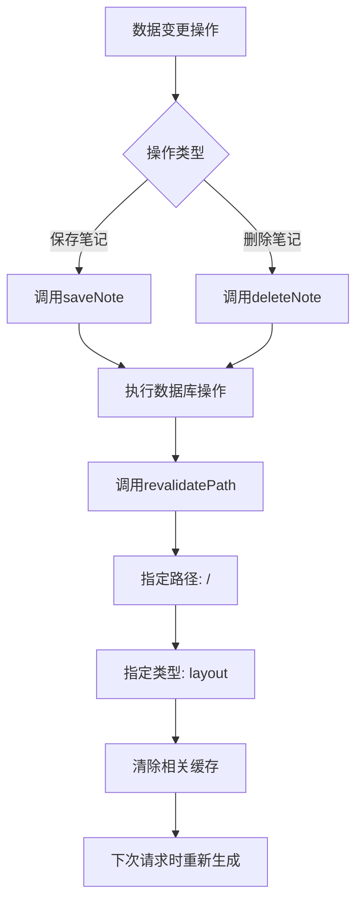
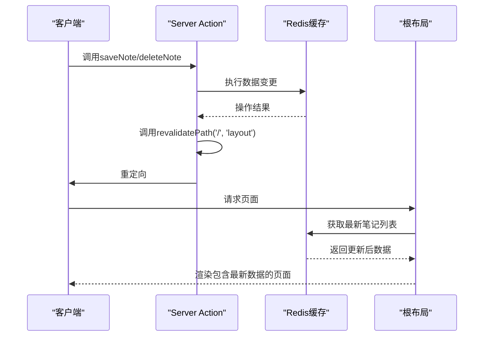
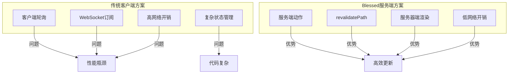

# 缓存管理

<cite>
**Referenced Files in This Document**  
- [app/[lng]/actions.ts](file://app/[lng]/actions.ts)
- [app/[lng]/layout.tsx](file://app/[lng]/layout.tsx)
- [components/Sidebar.tsx](file://components/Sidebar.tsx)
- [components/SidebarNoteList.tsx](file://components/SidebarNoteList.tsx)
- [lib/redis.ts](file://lib/redis.ts)
</cite>

## 目录
1. [引言](#引言)
2. [缓存刷新机制](#缓存刷新机制)
3. [数据变更与缓存同步](#数据变更与缓存同步)
4. [Next.js缓存策略原理](#nextjs缓存策略原理)
5. [服务端驱动的自动更新优势](#服务端驱动的自动更新优势)
6. [性能优化建议](#性能优化建议)
7. [高并发场景下的缓存一致性](#高并发场景下的缓存一致性)
8. [结论](#结论)

## 引言
在blessed项目中，缓存管理是确保用户界面实时性和系统性能的关键机制。本文档聚焦于`revalidatePath`在数据变更后的缓存刷新机制，详细说明如何通过服务端操作实现客户端视图的自动更新。该机制有效平衡了静态生成的高性能与动态数据的实时性需求，为用户提供流畅的笔记管理体验。

## 缓存刷新机制
blessed项目采用Next.js的服务器端缓存验证机制，通过`revalidatePath`函数实现特定路径的缓存重新验证。当调用`saveNote`或`deleteNote`等数据变更操作后，系统会触发`revalidatePath('/', 'layout')`，强制重新生成根布局层级的缓存。

该机制的核心在于指定`"layout"`作为重新验证类型，这确保了布局组件及其所有子组件（包括侧边栏）在下一次请求时都会被重新渲染。通过这种方式，即使页面其他部分采用静态生成，也能保证关键UI组件（如笔记列表）的实时更新。

**Diagram sources**
- [app/[lng]/actions.ts](file://app/[lng]/actions.ts#L50-L75)

**Section sources**
- [app/[lng]/actions.ts](file://app/[lng]/actions.ts#L1-L76)

## 数据变更与缓存同步
在blessed项目中，数据变更与UI同步通过服务端动作（Server Actions）实现无缝衔接。当用户执行保存或删除笔记操作时，系统在服务器端完成数据持久化后，立即调用`revalidatePath`触发缓存刷新。

侧边栏笔记列表的实时更新依赖于这一机制。`Sidebar`组件通过`SidebarNoteList`异步获取所有笔记数据，这些数据在服务器端渲染时从Redis缓存中读取。当`revalidatePath`被调用后，下一次对根路径的访问将重新执行`SidebarNoteList`的数据获取逻辑，从而反映最新的数据状态。

**Diagram sources**
- [app/[lng]/actions.ts](file://app/[lng]/actions.ts#L40-L75)
- [components/SidebarNoteList.tsx](file://components/SidebarNoteList.tsx#L1-L30)

**Section sources**
- [app/[lng]/actions.ts](file://app/[lng]/actions.ts#L40-L76)
- [components/SidebarNoteList.tsx](file://components/SidebarNoteList.tsx#L1-L30)

## Next.js缓存策略原理
Next.js的缓存策略在blessed项目中实现了静态生成与动态更新的完美平衡。系统采用`generateStaticParams`在构建时生成多语言静态页面，提升初始加载性能。同时，通过服务端动作和缓存验证机制，确保运行时数据变更能够及时反映在用户界面。

缓存层次结构从根布局开始，`revalidatePath`的调用会清除指定路径下所有相关组件的缓存。由于侧边栏嵌入在根布局中，对`"/"`路径的重新验证会强制重新渲染整个布局树，包括依赖于Redis数据的`SidebarNoteList`组件。这种设计避免了客户端轮询的资源浪费，实现了服务端驱动的高效更新。

**Section sources**
- [app/[lng]/layout.tsx](file://app/[lng]/layout.tsx#L1-L40)
- [app/[lng]/actions.ts](file://app/[lng]/actions.ts#L1-L76)

## 服务端驱动的自动更新优势
blessed项目的缓存管理机制相比传统客户端方案具有显著优势。首先，它消除了客户端轮询的需求，减少了不必要的网络请求和服务器负载。其次，通过服务端动作原子性地完成数据变更和缓存刷新，确保了数据一致性和操作的可靠性。

该机制还简化了前端状态管理。组件无需维护复杂的本地状态或订阅数据变更事件，而是依赖Next.js的服务器端渲染保证UI与数据的同步。这种"单一事实来源"的设计降低了代码复杂度，提高了应用的可维护性。

**Diagram sources**
- [app/[lng]/actions.ts](file://app/[lng]/actions.ts#L40-L75)

## 性能优化建议
为最大化缓存机制的性能效益，建议合理选择`revalidatePath`的路径范围。在blessed项目中，当前使用`"/"`路径会重新验证整个布局，虽然确保了数据一致性，但在大型应用中可能带来不必要的渲染开销。

优化方案包括：1) 使用更精确的路径匹配，如`"/note"`前缀路径，仅影响相关页面；2) 考虑使用`revalidateTag`配合缓存标签，实现更细粒度的缓存控制；3) 在非关键更新场景，可适当延迟重新验证，通过`setTimeout`批量处理多个变更操作。

此外，应监控Redis缓存的命中率和响应时间，确保数据层不会成为性能瓶颈。对于频繁读取的笔记列表，可考虑在`getAllNotes`中添加额外的缓存层或优化查询逻辑。

**Section sources**
- [app/[lng]/actions.ts](file://app/[lng]/actions.ts#L50-L75)
- [lib/redis.ts](file://lib/redis.ts#L1-L46)

## 高并发场景下的缓存一致性
在高并发场景下，blessed项目的缓存一致性主要依赖于Redis的原子操作和Next.js的请求隔离机制。`revalidatePath`的调用是同步的，确保在重定向前完成缓存清除，避免了脏读问题。

然而，当多个用户同时操作同一笔记时，仍可能存在竞态条件。建议的增强措施包括：1) 在Redis操作中使用事务或Lua脚本确保原子性；2) 为笔记添加版本号或时间戳，服务端验证操作的时效性；3) 实现乐观锁机制，在更新前检查数据的最后修改时间。

对于极高并发场景，可考虑引入消息队列，将缓存刷新操作异步化，避免大量同时的`revalidatePath`调用对服务器造成瞬时压力。同时，可通过监控系统跟踪缓存失效频率和页面重新生成时间，及时发现潜在的性能问题。

**Section sources**
- [app/[lng]/actions.ts](file://app/[lng]/actions.ts#L40-L75)
- [lib/redis.ts](file://lib/redis.ts#L1-L46)

## 结论
blessed项目通过`revalidatePath`机制实现了高效、可靠的缓存管理，完美平衡了静态生成的性能优势与动态数据的实时性需求。该服务端驱动的更新模式不仅简化了前端开发复杂度，还显著提升了用户体验。通过合理优化路径选择和增强高并发处理能力，该机制能够支持应用的持续扩展和性能提升。