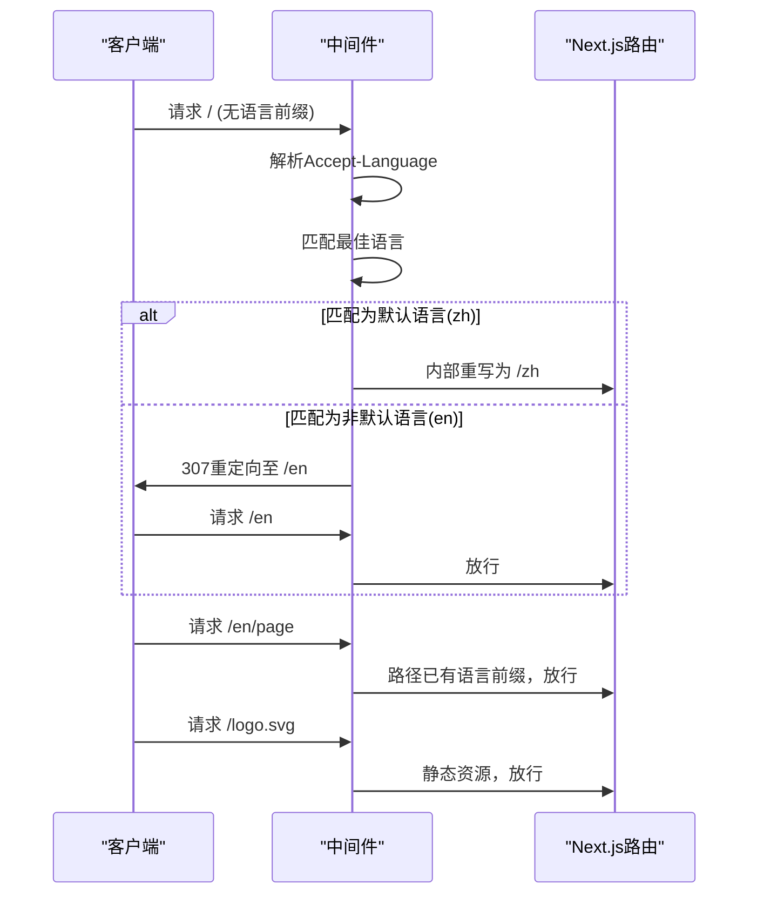
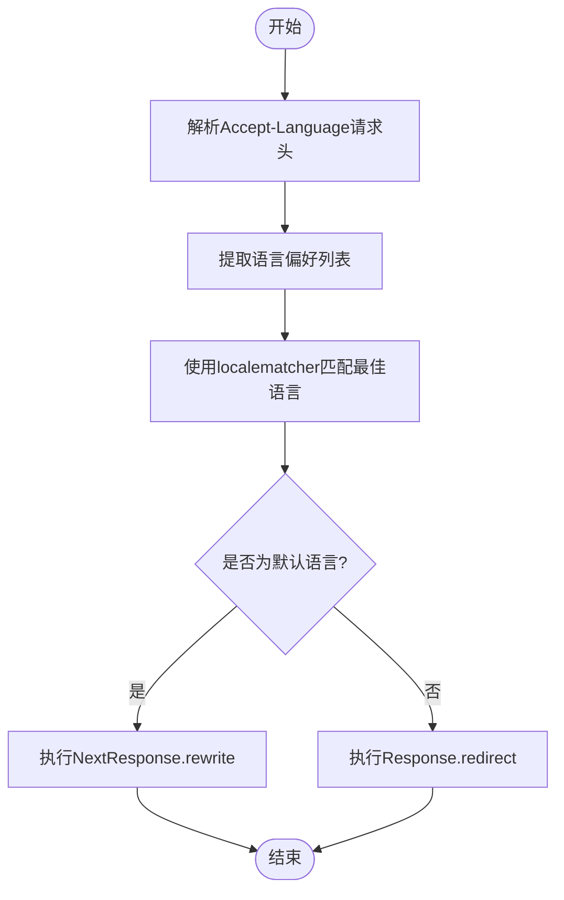
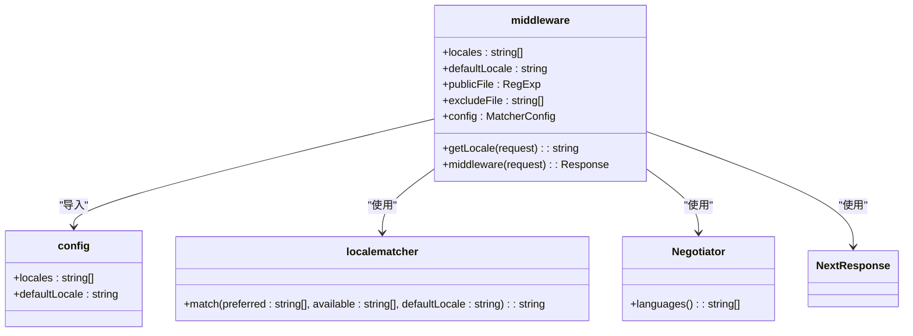

# 中间件语言路由匹配

<cite>
**Referenced Files in This Document**   
- [middleware.ts](file://middleware.ts)
- [config.ts](file://config.ts)
- [app/i18n/index.ts](file://app/i18n/index.ts)
- [app/i18n/client.ts](file://app/i18n/client.ts)
</cite>

## 目录
1. [项目结构](#项目结构)
2. [核心组件](#核心组件)
3. [架构概述](#架构概述)
4. [详细组件分析](#详细组件分析)
5. [依赖分析](#依赖分析)
6. [性能考虑](#性能考虑)
7. [故障排除指南](#故障排除指南)
8. [结论](#结论)

## 项目结构

项目采用基于Next.js的现代化架构，遵循功能模块化组织原则。根目录包含核心配置文件（config.ts、next.config.ts）和中间件（middleware.ts）。应用主体位于`app`目录下，采用基于路由的国际化方案，通过`[lng]`动态路由段实现多语言支持。`i18n`子目录集中管理国际化资源和逻辑，`locales`文件夹按语言代码组织翻译文件。`components`目录存放可复用UI组件，`lib`目录包含共享工具和类型定义，`public`目录存放静态资源。

```mermaid
graph TB
subgraph "Root"
middleware[中间件 middleware.ts]
config[配置 config.ts]
nextConfig[Next配置 next.config.ts]
end
subgraph "App"
app[应用根目录 app/]
lng[动态语言路由 [lng]/]
i18n[国际化模块 i18n/]
end
subgraph "Components"
components[UI组件 components/]
lib[工具库 lib/]
public[静态资源 public/]
end
middleware --> app : "拦截请求"
config --> middleware : "提供locales"
config --> i18n : "提供defaultLocale"
i18n --> lng : "提供翻译资源"
```

**Diagram sources**
- [middleware.ts](file://middleware.ts#L1-L50)
- [config.ts](file://config.ts#L1-L3)
- [app/i18n/index.ts](file://app/i18n/index.ts#L1-L54)

**Section sources**
- [middleware.ts](file://middleware.ts#L1-L50)
- [config.ts](file://config.ts#L1-L3)

## 核心组件

本系统的核心组件是`middleware.ts`中的语言路由中间件，它负责在请求到达应用前进行语言匹配和路由处理。该组件依赖`config.ts`中定义的`locales`和`defaultLocale`配置，利用`@formatjs/intl-localematcher`库进行语言偏好匹配，并通过`Negotiator`解析HTTP请求头。其主要职责包括：解析用户语言偏好、判断是否需要重定向、保护静态资源不被拦截、以及根据语言策略执行重定向或内部重写。

**Section sources**
- [middleware.ts](file://middleware.ts#L1-L50)
- [config.ts](file://config.ts#L1-L3)

## 架构概述

系统采用分层架构，中间件层位于客户端与应用路由之间，作为请求处理的第一道关卡。当用户发起请求时，中间件首先检查路径是否已包含有效语言前缀，若存在则放行。接着检查请求是否针对静态资源，若是则跳过处理。对于需要语言处理的请求，中间件从`Accept-Language`请求头提取用户偏好，结合应用支持的语言列表进行最佳匹配。匹配结果决定后续行为：若为默认语言则内部重写URL，保持SEO友好；若为非默认语言则执行307临时重定向，确保URL规范性。



**Diagram sources**
- [middleware.ts](file://middleware.ts#L19-L44)
- [config.ts](file://config.ts#L1-L3)

## 详细组件分析

### 语言匹配机制分析

中间件通过`Negotiator`库解析HTTP请求头中的`Accept-Language`字段，该字段包含用户浏览器设置的语言偏好列表及优先级。`getLocale`函数将这些偏好与应用支持的`locales`（["zh", "en"]）进行匹配，利用`@formatjs/intl-localematcher`库实现最佳匹配算法。匹配过程考虑语言代码的精确度和用户偏好权重，确保返回最符合用户期望的语言代码。



**Diagram sources**
- [middleware.ts](file://middleware.ts#L11-L15)
- [config.ts](file://config.ts#L1-L3)

### 路径处理逻辑分析

`pathnameHasLocale`函数通过检查请求路径是否以任一支持的语言代码开头来判断是否已本地化。此逻辑避免了对已包含语言前缀的URL进行重复处理。同时，`publicFile`正则表达式和`excludeFile`数组共同保护静态资源不被重定向，确保`/logo.svg`等资源可直接访问。

**Section sources**
- [middleware.ts](file://middleware.ts#L22-L30)

### 重定向策略分析

系统采用差异化的重定向策略：对于非默认语言（如"en"），使用`Response.redirect`执行307临时重定向，将用户引导至`/en`路径，这有助于搜索引擎发现所有语言版本。对于默认语言（"zh"），使用`NextResponse.rewrite`进行内部URL重写，用户访问根路径`/`时直接渲染中文内容，既提升了用户体验又优化了中文SEO，因为根路径通常具有最高的权重。

**Section sources**
- [middleware.ts](file://middleware.ts#L38-L44)

## 依赖分析



**Diagram sources**
- [middleware.ts](file://middleware.ts#L1-L50)
- [config.ts](file://config.ts#L1-L3)

**Section sources**
- [middleware.ts](file://middleware.ts#L1-L50)
- [config.ts](file://config.ts#L1-L3)

## 性能考虑

该中间件设计对性能影响极小。语言匹配和路径检查均为轻量级操作，正则表达式测试和数组查找的时间复杂度较低。通过`matcher`配置排除API端点和静态资源路径，避免了不必要的处理开销。内部重写（rewrite）比外部重定向（redirect）更高效，减少了网络往返。建议监控中间件执行时间，确保其保持在毫秒级别。

## 故障排除指南

常见问题包括语言匹配不准确、静态资源被错误重定向、或默认语言行为异常。检查`Accept-Language`请求头格式是否正确，验证`locales`数组与路由配置的一致性，确认`publicFile`正则表达式能正确识别所有静态资源。若出现无限重定向循环，检查`pathnameHasLocale`逻辑是否正确处理了所有语言前缀情况。

**Section sources**
- [middleware.ts](file://middleware.ts#L22-L30)
- [middleware.ts](file://middleware.ts#L38-L44)

## 结论

该中间件实现了高效、灵活的多语言路由解决方案。通过智能的语言匹配和差异化的重定向策略，既保证了良好的用户体验，又优化了SEO效果。中文作为默认语言的设计符合目标用户群体特征，根路径直接渲染中文内容提升了访问效率。整体架构清晰，依赖明确，易于维护和扩展。