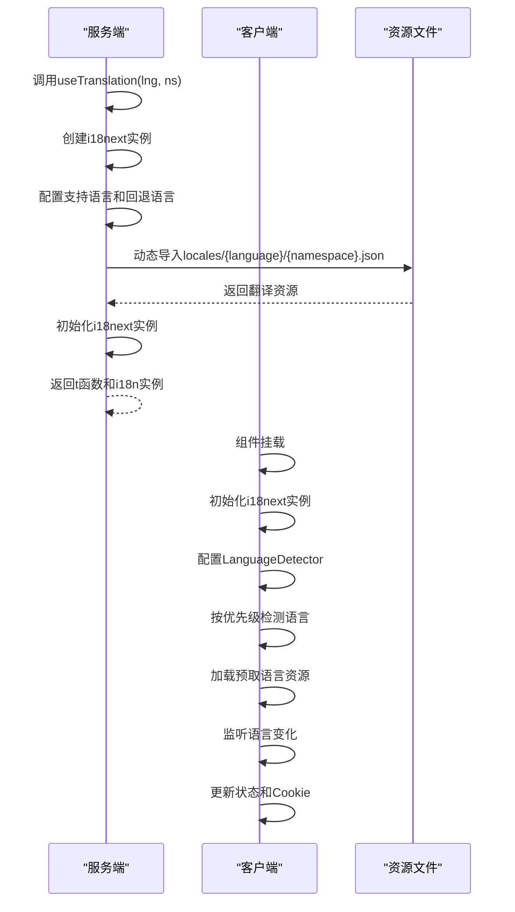
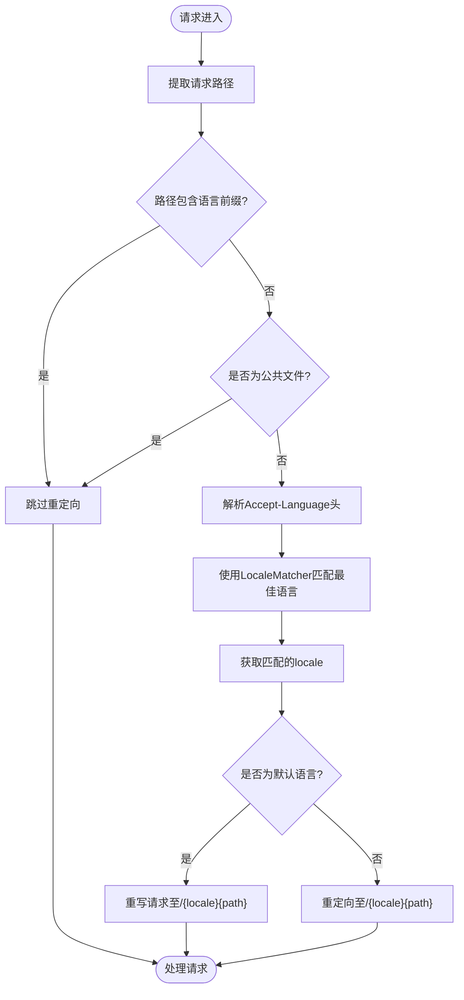
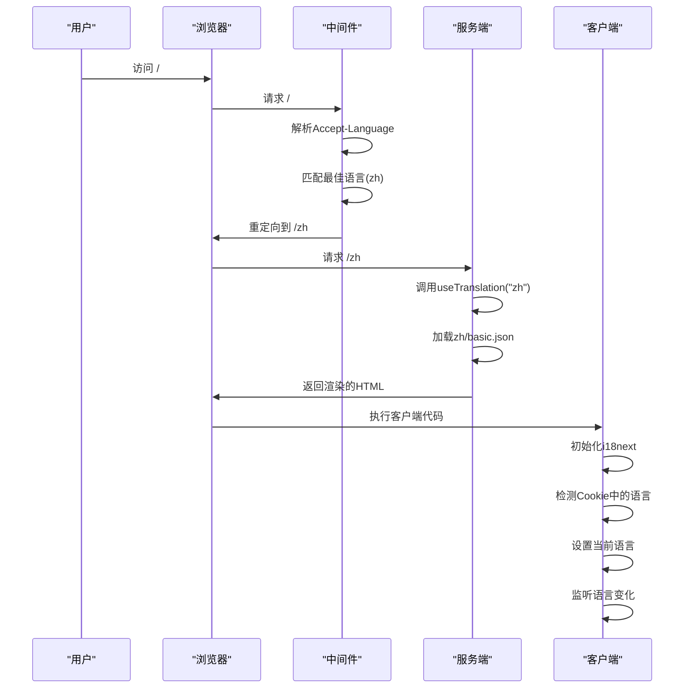

# 国际化实现

<cite>
**Referenced Files in This Document**   
- [app/i18n/index.ts](file://app/i18n/index.ts)
- [app/i18n/client.ts](file://app/i18n/client.ts)
- [middleware.ts](file://middleware.ts)
- [config.ts](file://config.ts)
- [app/i18n/locales/zh/basic.json](file://app/i18n/locales/zh/basic.json)
- [app/i18n/locales/en/basic.json](file://app/i18n/locales/en/basic.json)
- [app/[lng]/layout.tsx](file://app/[lng]/layout.tsx)
</cite>

## 目录
1. [国际化实现](#国际化实现)
2. [i18n模块架构](#i18n模块架构)
3. [多语言资源配置](#多语言资源配置)
4. [服务端与客户端i18n初始化](#服务端与客户端i18n初始化)
5. [语言匹配与路由重定向机制](#语言匹配与路由重定向机制)
6. [语言配置参数](#语言配置参数)
7. [语言切换流程](#语言切换流程)
8. [组件中的文本翻译使用](#组件中的文本翻译使用)
9. [静态路径预生成](#静态路径预生成)

## i18n模块架构

blessed项目的国际化实现基于i18next生态系统构建，采用服务端与客户端协同工作的架构模式。系统通过`i18next`核心库提供翻译功能，结合`react-i18next`实现React组件集成，并利用`i18next-resources-to-backend`动态加载语言资源文件。

该架构分为两个主要部分：服务端初始化逻辑位于`app/i18n/index.ts`，负责在服务器渲染时提供翻译服务；客户端hook逻辑位于`app/i18n/client.ts`，负责在浏览器环境中管理语言状态和响应语言切换。这种分离设计确保了服务端渲染的SEO友好性和客户端交互的响应性。

**Section sources**
- [app/i18n/index.ts](file://app/i18n/index.ts#L1-L54)
- [app/i18n/client.ts](file://app/i18n/client.ts#L1-L75)

## 多语言资源配置

项目在`app/i18n/locales/`目录下组织多语言资源文件，采用基于语言代码的目录结构。每个语言目录包含`basic.json`文件，存储该语言的翻译键值对。当前支持中文(`zh`)和英文(`en`)两种语言。

翻译资源采用扁平化的键值结构，如`"new": "+"`和`"initText": "点击左侧笔记查阅内容 🥺"`。这种设计简化了翻译查找过程，提高了性能。资源文件通过动态导入机制按需加载，减少初始加载体积。

```mermaid
graph TB
Locales[locales/] --> Zh[zh/]
Locales --> En[en/]
Zh --> BasicZh[basic.json]
En --> BasicEn[basic.json]
BasicZh --> |包含| TranslationsZh["键值对: \"new\": \"+\"", \"initText\": \"点击左侧笔记查阅内容 🥺\""]
BasicEn --> |包含| TranslationsEn["键值对: \"new\": \"new\"", \"initText\": \"Click a note on the left to view something! 🥺\""]
```

**Diagram sources**
- [app/i18n/locales/zh/basic.json](file://app/i18n/locales/zh/basic.json#L1-L6)
- [app/i18n/locales/en/basic.json](file://app/i18n/locales/en/basic.json#L1-L6)

## 服务端与客户端i18n初始化

服务端i18n初始化通过`app/i18n/index.ts`中的`useTranslation`函数实现。该函数异步创建i18next实例，配置支持的语言、回退语言和命名空间，并使用`resourcesToBackend`从`locales`目录动态加载对应语言的JSON资源文件。

客户端i18n初始化在`app/i18n/client.ts`中完成，使用`use client`指令标识为客户端组件。它初始化i18next实例并集成`LanguageDetector`插件，按照路径、HTML标签、Cookie和浏览器语言检测器的顺序确定当前语言。客户端还通过React的`useEffect`钩子监听语言变化，并将选择的语言存储在Cookie中以保持用户偏好。



**Diagram sources**
- [app/i18n/index.ts](file://app/i18n/index.ts#L1-L54)
- [app/i18n/client.ts](file://app/i18n/client.ts#L1-L75)

## 语言匹配与路由重定向机制

`middleware.ts`文件实现了语言匹配与自动路由重定向的核心逻辑。中间件通过`@formatjs/intl-localematcher`库解析请求头中的`accept-language`字段，使用`Negotiator`工具提取客户端偏好语言列表，并在支持的语言列表中进行最佳匹配。

当请求路径不包含语言前缀时，中间件根据匹配结果自动重定向到对应语言路由（如`/en`或`/zh`）。默认语言（`zh`）的请求使用`rewrite`而非`redirect`，避免URL变化，提升用户体验。公共文件（如静态资源）和API路由被排除在重定向逻辑之外，确保系统性能和功能完整性。



**Diagram sources**
- [middleware.ts](file://middleware.ts#L1-L50)

## 语言配置参数

`config.ts`文件定义了国际化系统的核心配置参数：`locales`数组指定支持的语言列表（`["zh", "en"]`），`defaultLocale`常量设置默认语言为中文（`"zh"`）。这些配置被i18n模块、中间件和布局组件广泛引用，确保系统各部分语言设置的一致性。

`locales`配置不仅限制了可用语言选项，还用于静态路径生成和语言匹配过程。`defaultLocale`配置决定了当无法匹配用户偏好时的回退语言，以及默认路由的重写行为。这种集中式配置方式便于维护和扩展，新增语言时只需修改这两个参数即可。

**Section sources**
- [config.ts](file://config.ts#L1-L3)

## 语言切换流程

语言切换流程涉及多个组件的协同工作。当用户访问无语言前缀的路径时，中间件解析`accept-language`头，匹配最佳语言，并重定向到对应语言路由。服务端渲染时，`useTranslation`函数根据路径中的语言参数加载相应资源文件，提供翻译函数`t`。

客户端通过`useTranslation` hook获取`t`函数，并使用`useEffect`监听语言变化。当语言切换发生时，客户端更新i18next实例的当前语言，并将选择存储在名为`i18next`的Cookie中。后续请求携带此Cookie，确保用户偏好被记住。



**Diagram sources**
- [middleware.ts](file://middleware.ts#L1-L50)
- [app/i18n/index.ts](file://app/i18n/index.ts#L1-L54)
- [app/i18n/client.ts](file://app/i18n/client.ts#L1-L75)

## 组件中的文本翻译使用

在React组件中，通过导入并调用`useTranslation` hook获取`t`函数进行文本翻译。`t`函数接收翻译键作为参数，返回对应语言的翻译文本。例如，在组件中调用`t('new')`将根据当前语言返回`"+"`（中文）或`"new"`（英文）。

`useTranslation`需要传入当前语言参数（`lng`），通常从路由参数获取。该hook返回`t`函数和`i18n`实例，允许组件访问翻译功能和语言状态。通过这种方式，所有用户界面文本都可实现多语言支持，确保应用的国际化能力。

**Section sources**
- [app/i18n/client.ts](file://app/i18n/client.ts#L46-L73)

## 静态路径预生成

`app/[lng]/layout.tsx`文件中的`generateStaticParams`函数负责预生成多语言静态路径。该函数利用`config.ts`中的`locales`配置，为每个支持的语言生成对应的静态参数对象。Next.js在构建时调用此函数，为`/zh`和`/en`等语言路径生成静态页面。

这种预生成策略避免了运行时动态渲染的性能开销，提升了页面加载速度和SEO效果。每个语言版本的页面在构建时独立生成，确保服务端渲染的完整性和一致性。当新增语言时，只需在`locales`配置中添加语言代码，`generateStaticParams`将自动包含新语言的静态路径。

**Section sources**
- [app/[lng]/layout.tsx](file://app/[lng]/layout.tsx#L15-L17)
- [config.ts](file://config.ts#L1-L3)