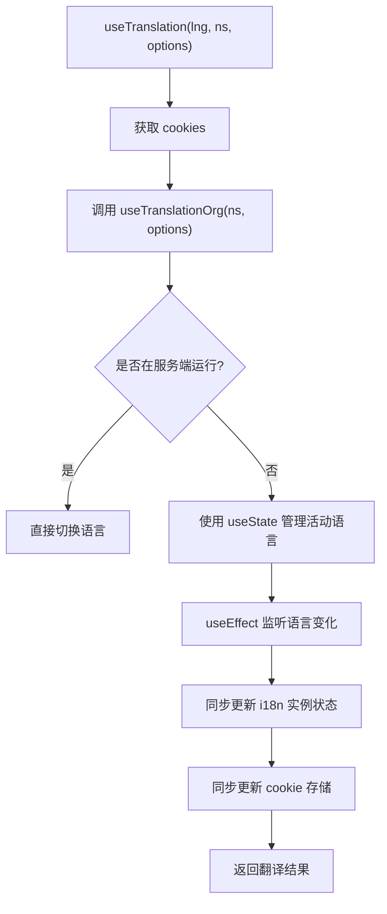
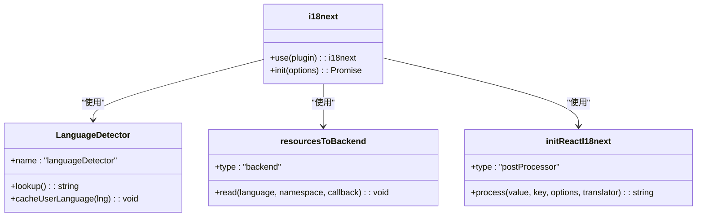
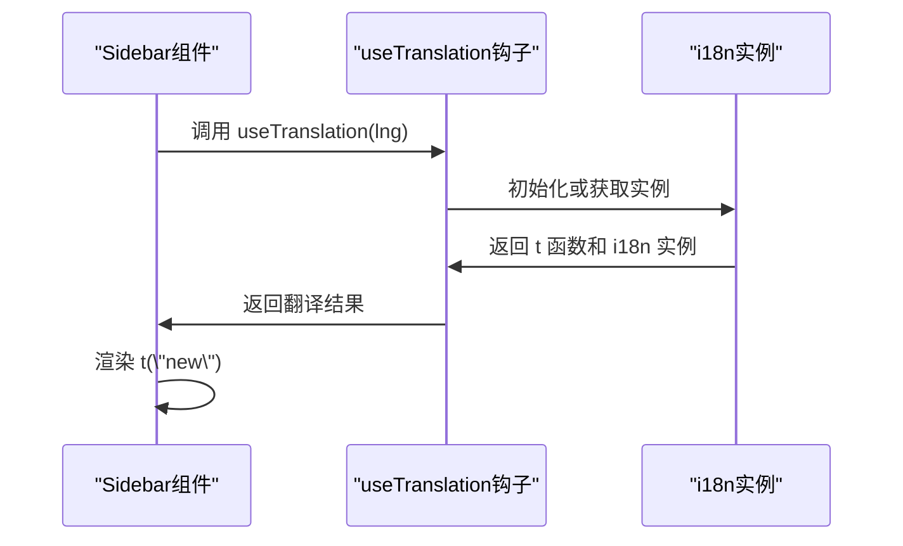
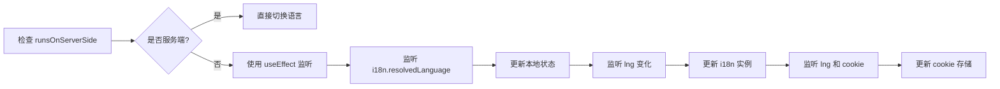

# 客户端国际化集成

<cite>
**Referenced Files in This Document**   
- [client.ts](file://app/i18n/client.ts)
- [index.ts](file://app/i18n/index.ts)
- [Sidebar.tsx](file://components/Sidebar.tsx)
</cite>

## 目录
1. [简介](#简介)
2. [核心组件](#核心组件)
3. [客户端国际化机制](#客户端国际化机制)
4. [语言检测与初始化](#语言检测与初始化)
5. [实际用例分析](#实际用例分析)
6. [环境区分与持久化](#环境区分与持久化)

## 简介
本文档全面介绍客户端国际化机制的实现细节，重点分析 `app/i18n/client.ts` 文件中如何封装 `react-i18next` 的国际化功能，实现多语言支持。文档将详细解释 `useTranslation` 高阶函数的封装逻辑、i18next 实例的初始化过程、语言变化的监听与同步机制，以及在实际组件中的使用方法。

## 核心组件

本节分析客户端国际化实现的核心组件及其相互关系。

**Section sources**
- [client.ts](file://app/i18n/client.ts#L1-L74)
- [index.ts](file://app/i18n/index.ts#L1-L53)

## 客户端国际化机制

`app/i18n/client.ts` 文件通过 `useTranslation` 高阶函数封装了 `react-i18next` 的 `useTranslationOrg`，为客户端组件提供多语言支持。该函数接收语言代码（lng）、命名空间（ns）和选项（options）作为参数，返回翻译函数和 i18n 实例。

**Diagram sources**
- [client.ts](file://app/i18n/client.ts#L46-L73)

**Section sources**
- [client.ts](file://app/i18n/client.ts#L46-L73)

## 语言检测与初始化

i18next 实例在客户端的初始化过程中配置了 `LanguageDetector` 插件，其检测顺序为 `path > htmlTag > cookie > navigator`。这种优先级策略确保了语言选择的灵活性和一致性。

**Diagram sources**
- [client.ts](file://app/i18n/client.ts#L25-L44)

**Section sources**
- [client.ts](file://app/i18n/client.ts#L25-L44)

## 实际用例分析

通过 `Sidebar.tsx` 组件的实际用例，展示如何在客户端组件中调用 `useTranslation(lng, 'basic')` 获取 `t` 函数并渲染翻译文本。

**Diagram sources**
- [Sidebar.tsx](file://components/Sidebar.tsx#L1-L40)
- [client.ts](file://app/i18n/client.ts#L46-L73)

**Section sources**
- [Sidebar.tsx](file://components/Sidebar.tsx#L1-L40)

## 环境区分与持久化

`runsOnServerSide` 标志位用于区分运行环境，避免在服务端执行浏览器 API。`useEffect` 钩子监听语言变化，同步更新 i18n 实例状态与 cookie（i18next）存储，确保页面刷新后语言偏好持久化。

**Diagram sources**
- [client.ts](file://app/i18n/client.ts#L55-L73)

**Section sources**
- [client.ts](file://app/i18n/client.ts#L55-L73)