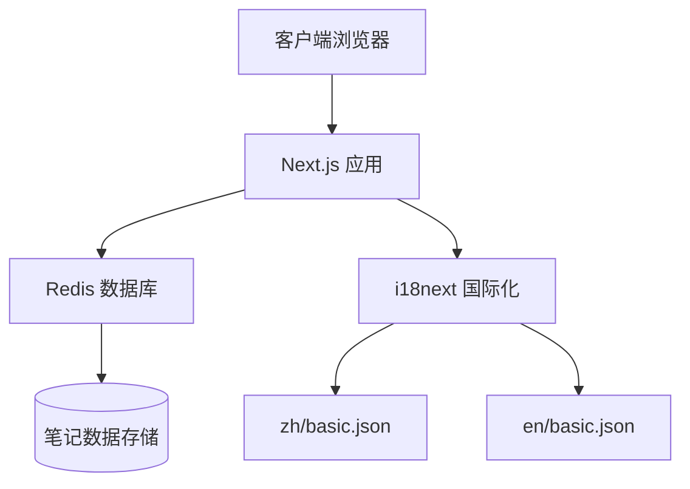
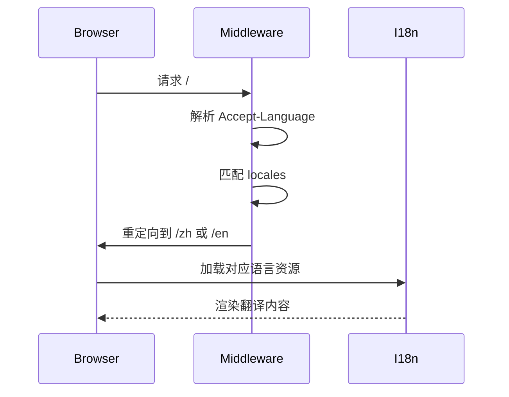

# 开发者入门指南

<cite>
**本文档引用文件**  
- [README.md](file://README.md)
- [package.json](file://package.json)
- [lib/redis.ts](file://lib/redis.ts)
- [app/i18n/index.ts](file://app/i18n/index.ts)
- [middleware.ts](file://middleware.ts)
- [app/[lng]/page.tsx](file://app/[lng]/page.tsx)
- [app/[lng]/note/[id]/page.tsx](file://app/[lng]/note/[id]/page.tsx)
- [app/[lng]/note/edit/[id]/page.tsx](file://app/[lng]/note/edit/[id]/page.tsx)
- [components/NoteEditor.tsx](file://components/NoteEditor.tsx)
- [components/SidebarNoteItem.tsx](file://components/SidebarNoteItem.tsx)
</cite>

## 目录
1. [简介](#简介)
2. [前置条件](#前置条件)
3. [本地开发环境搭建](#本地开发环境搭建)
4. [项目结构概览](#项目结构概览)
5. [核心功能操作指南](#核心功能操作指南)
6. [多语言支持机制](#多语言支持机制)
7. [调试与日志查看](#调试与日志查看)
8. [常见问题解答](#常见问题解答)
9. [进一步学习资源](#进一步学习资源)

## 简介

本指南旨在帮助新加入的开发者快速搭建本地开发环境，理解项目的基本架构与操作流程。该项目基于 Next.js 15 构建，采用 Turbopack 提升开发服务器性能，并集成 Redis 作为数据存储，支持中英文双语切换。

**Section sources**
- [README.md](file://README.md#L1-L36)

## 前置条件

在开始开发前，请确保已安装以下依赖：

- **Node.js 18+**：项目依赖现代 JavaScript 特性，需 Node.js 18 或更高版本。
- **pnpm**：作为包管理器，用于安装项目依赖。
- **Redis 服务器**：可使用本地安装的 Redis 或远程 Redis 服务，用于存储笔记数据。

可通过以下命令验证环境：
```bash
node --version
pnpm --version
redis-server --version
```

## 本地开发环境搭建

按照以下步骤快速启动项目：

1. **克隆仓库**
   ```bash
   git clone <repository-url>
   cd blessed
   ```

2. **安装依赖**
   ```bash
   pnpm install
   ```

3. **启动 Redis 服务**
   - 若使用本地 Redis：
     ```bash
     redis-server
     ```
   - 若使用 Docker：
     ```bash
     docker run -p 6379:6379 redis
     ```

4. **运行开发服务器**
   ```bash
   pnpm dev --turbo
   ```
   此命令将启动 Next.js 开发服务器并启用 Turbopack 加速构建。

5. **访问应用**
   打开浏览器并访问 [http://localhost:3000](http://localhost:3000)，即可查看应用界面。

**Section sources**
- [package.json](file://package.json#L6-L10)
- [README.md](file://README.md#L6-L13)

## 项目结构概览

项目采用 Next.js App Router 架构，主要目录结构如下：

- `app/[lng]`：支持多语言的页面路由，`[lng]` 为动态语言参数。
- `app/i18n`：国际化配置与资源文件。
- `components/`：UI 组件，如笔记编辑器、侧边栏等。
- `lib/`：工具函数与类型定义，包含 Redis 操作逻辑。
- `public/`：静态资源文件。
- `config.ts`：语言与区域设置。



**Diagram sources**
- [app/i18n/index.ts](file://app/i18n/index.ts#L1-L54)
- [lib/redis.ts](file://lib/redis.ts#L1-L46)

## 核心功能操作指南

### 创建、编辑与删除笔记

1. **创建笔记**  
   在侧边栏点击“新建笔记”，进入编辑界面，输入标题与内容后点击“保存”。

2. **编辑笔记**  
   点击左侧笔记列表中的某一项，进入预览界面，点击“编辑”按钮进行修改。

3. **删除笔记**  
   在编辑界面点击“删除”按钮，确认后该笔记将从 Redis 中移除。

这些操作通过 `actions.ts` 中的服务器操作函数实现，结合客户端组件 `NoteEditor` 与表单状态管理完成。

**Section sources**
- [components/NoteEditor.tsx](file://components/NoteEditor.tsx#L1-L93)
- [app/[lng]/note/edit/[id]/page.tsx](file://app/[lng]/note/edit/[id]/page.tsx#L1-L30)
- [app/[lng]/note/[id]/page.tsx](file://app/[lng]/note/[id]/page.tsx#L1-L25)

## 多语言支持机制

项目通过 `i18next` 实现多语言支持，语言切换逻辑如下：

- 访问 `/zh` 路径时，应用显示中文界面。
- 访问 `/en` 路径时，应用显示英文界面。
- 默认语言由 `config.ts` 中的 `defaultLocale` 定义。
- 浏览器语言偏好通过 `Accept-Language` 头自动匹配，由 `middleware.ts` 实现重定向。

翻译资源位于 `app/i18n/locales/` 目录下，支持 `basic.json` 格式的键值对。



**Diagram sources**
- [middleware.ts](file://middleware.ts#L1-L50)
- [app/i18n/index.ts](file://app/i18n/index.ts#L1-L54)

## 调试与日志查看

### 浏览器控制台
- 在 `NoteEditor` 组件中，若保存或删除失败，错误信息将输出至控制台：
  ```ts
  useEffect(() => {
    if (saveState?.error) {
      console.error("Save error:", saveState.error);
    }
  }, [saveState]);
  ```

### 服务端日志
- 启动开发服务器后，所有请求与错误将输出至终端。
- Redis 操作异常可通过 `redis.ts` 中的 `console.log` 或错误捕获机制查看。

建议在开发过程中保持终端与浏览器开发者工具开启，以便实时监控应用状态。

**Section sources**
- [components/NoteEditor.tsx](file://components/NoteEditor.tsx#L37-L42)
- [lib/redis.ts](file://lib/redis.ts#L1-L46)

## 常见问题解答

### Redis 连接失败
- **问题**：`Error: connect ECONNREFUSED 127.0.0.1:6379`
- **解决方案**：确保 Redis 服务已启动。可通过 `redis-cli ping` 测试连接。

### 依赖安装失败
- **问题**：`pnpm install` 报错，如 `ENOTFOUND` 或 `ECONNRESET`
- **解决方案**：检查网络连接，或尝试使用国内镜像源：
  ```bash
  pnpm config set registry https://registry.npmmirror.com
  ```

### 页面无法加载
- **问题**：访问 `http://localhost:3000` 显示空白或 404
- **解决方案**：确认 `pnpm dev` 命令已成功启动，且无构建错误。检查端口是否被占用。

**Section sources**
- [lib/redis.ts](file://lib/redis.ts#L3-L5)
- [package.json](file://package.json#L1-L42)

## 进一步学习资源

- **Next.js 官方文档**：[https://nextjs.org/docs](https://nextjs.org/docs)  
  学习 App Router、服务器组件、数据获取等核心概念。
- **Next.js 交互教程**：[https://nextjs.org/learn](https://nextjs.org/learn)  
  通过实践掌握 Next.js 开发流程。
- **i18next 官方指南**：[https://www.i18next.com](https://www.i18next.com)  
  深入了解多语言集成与插件机制。
- **Vercel 部署文档**：[https://nextjs.org/docs/app/building-your-application/deploying](https://nextjs.org/docs/app/building-your-application/deploying)  
  了解如何将应用部署至生产环境。