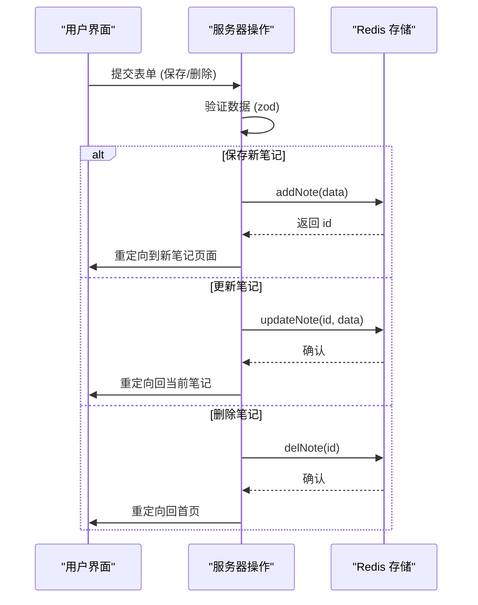

# 数据模型与Redis存储

<cite>
**Referenced Files in This Document**   
- [lib/types.ts](file://lib/types.ts)
- [lib/redis.ts](file://lib/redis.ts)
- [app/[lng]/actions.ts](file://app/[lng]/actions.ts)
- [app/[lng]/note/[id]/page.tsx](file://app/[lng]/note/[id]/page.tsx)
- [app/[lng]/note/edit/[id]/page.tsx](file://app/[lng]/note/edit/[id]/page.tsx)
- [components/SidebarNoteList.tsx](file://components/SidebarNoteList.tsx)
</cite>

## 目录
1. [数据模型定义](#数据模型定义)
2. [Redis存储方案](#redis存储方案)
3. [核心操作函数](#核心操作函数)
4. [数据生命周期与扩展](#数据生命周期与扩展)

## 数据模型定义

本项目的核心数据模型由 `lib/types.ts` 文件中的 `NoteData` 接口定义，它作为整个应用的数据契约，确保了前后端及存储层之间数据结构的一致性。

`NoteData` 接口包含以下字段：
- **title**: 字符串类型，表示笔记的标题。
- **content**: 字符串类型，表示笔记的正文内容。
- **updateTime**: `Date` 类型，表示笔记的最后更新时间戳。

该接口在 `redis.ts` 中被广泛用作函数参数和返回值的类型，例如 `addNote` 和 `getNote` 函数。此外，`actions.ts` 文件中的 `saveNote` 操作也直接使用此接口来构造和验证数据，确保了从用户输入到持久化存储的整个流程中数据结构的统一。

**Section sources**
- [lib/types.ts](file://lib/types.ts#L1-L5)
- [lib/redis.ts](file://lib/redis.ts#L22-L38)
- [app/[lng]/actions.ts](file://app/[lng]/actions.ts#L18-L56)

## Redis存储方案

项目采用 Redis 作为笔记数据的持久化存储，利用其高效的哈希（Hash）数据结构来组织数据。

### 存储结构
- **键名 (Key)**: 所有笔记数据存储在一个名为 `notes` 的哈希表中。
- **字段 (Field)**: 哈希表的每个字段名是笔记的唯一标识符 `id`，该 `id` 在 `addNote` 函数中通过 `Date.now().toString()` 生成，确保了全局唯一性。
- **值 (Value)**: 每个字段的值是 `NoteData` 对象的 JSON 序列化字符串。

### 数据示例
一个典型的 Redis 哈希结构数据如下所示：
```
notes
├── "1702459181837" -> {"title":"sunt aut","content":"quia et suscipit...","updateTime":"2023-12-13T09:19:48.837Z"}
├── "1702459182837" -> {"title":"qui est","content":"est rerum tempore...","updateTime":"2023-12-13T09:19:48.837Z"}
└── "1702459188837" -> {"title":"ea molestias","content":"et iusto sed quo iure","updateTime":"2023-12-13T09:19:48.837Z"}
```

### 初始化逻辑
`redis.ts` 文件中定义了一个 `initialData` 常量，包含三条示例笔记。`getAllNotes` 函数在首次调用时会检查 `notes` 哈希表是否为空，若为空则将 `initialData` 写入，为用户提供初始数据。

```mermaid
erDiagram
NOTES ||--o{ NOTE : contains
class NOTES {
string key: "notes"
}
class NOTE {
string id (field)
string json_value (value)
}
```

**Diagram sources**
- [lib/redis.ts](file://lib/redis.ts#L6-L12)
- [lib/redis.ts](file://lib/redis.ts#L14-L20)

**Section sources**
- [lib/redis.ts](file://lib/redis.ts#L6-L20)

## 核心操作函数

`lib/redis.ts` 文件导出了多个异步函数，用于对笔记数据进行增删改查（CRUD）操作，这些函数构成了应用的数据访问层。

### getAllNotes
此函数用于获取所有笔记。它调用 `redis.hgetall("notes")` 从 Redis 中读取整个哈希表，并返回一个 `Notes` 类型的对象。该函数在 `SidebarNoteList.tsx` 组件中被调用，以渲染侧边栏的笔记列表。

### getNote
此函数根据 `id` 获取单个笔记。它调用 `redis.hget("notes", uuid)` 从哈希表中获取指定 `id` 的 JSON 字符串，然后使用 `JSON.parse()` 将其反序列化为 `NoteData` 对象。如果笔记不存在，返回 `null`。该函数被 `page.tsx` 和 `edit/[id]/page.tsx` 页面用于加载笔记内容。

### addNote
此函数用于创建新笔记。它首先生成一个基于时间戳的唯一 `id`，然后将传入的 `NoteData` 对象序列化为 JSON 字符串，最后通过 `redis.hset("notes", uuid, noteData)` 将其存入 Redis 哈希表。

### updateNote
此函数用于更新现有笔记。其逻辑与 `addNote` 类似，同样是将 `NoteData` 对象序列化后，使用 `redis.hset` 方法写入 Redis。由于 `hset` 在字段存在时会覆盖原值，因此实现了更新操作。

### delNote
此函数用于删除笔记。它调用 `redis.hdel("notes", uuid)` 从 `notes` 哈希表中删除指定 `id` 的字段，并返回被删除字段的数量。

所有这些函数都使用 `async/await` 语法处理异步操作，并在 `actions.ts` 中被 `saveNote` 和 `deleteNote` 服务器操作所调用，实现了从用户界面到数据存储的完整链路。



**Diagram sources**
- [lib/redis.ts](file://lib/redis.ts#L14-L42)
- [app/[lng]/actions.ts](file://app/[lng]/actions.ts#L18-L74)

**Section sources**
- [lib/redis.ts](file://lib/redis.ts#L14-L42)
- [app/[lng]/actions.ts](file://app/[lng]/actions.ts#L18-L74)
- [app/[lng]/note/[id]/page.tsx](file://app/[lng]/note/[id]/page.tsx#L1-L24)
- [app/[lng]/note/edit/[id]/page.tsx](file://app/[lng]/note/edit/[id]/page.tsx#L1-L29)
- [components/SidebarNoteList.tsx](file://components/SidebarNoteList.tsx#L1-L29)

## 数据生命周期与扩展

### 数据生命周期
笔记数据的生命周期始于用户在编辑页面创建或修改笔记，通过 `saveNote` 操作触发 `addNote` 或 `updateNote` 函数，数据被序列化后存入 Redis。当用户访问笔记页面时，`getNote` 函数被调用，从 Redis 中读取并反序列化数据。删除操作则通过 `delNote` 函数从 Redis 中移除数据。`revalidatePath` 的调用确保了 Next.js 的缓存能及时更新，使用户界面能反映最新的数据状态。

### 潜在扩展方向
当前的数据模型是基础的，未来可以考虑以下扩展：
- **增加用户ID字段**: 在 `NoteData` 接口中添加 `userId: string` 字段，以支持多用户系统，每个用户只能访问和管理自己的笔记。
- **增强数据类型**: 可以将 `content` 字段从纯文本扩展为支持 Markdown 或富文本格式。
- **添加创建时间**: 当前只有 `updateTime`，可以增加 `createTime` 字段来记录笔记的创建时间。
- **引入标签系统**: 增加 `tags: string[]` 字段，允许用户为笔记打标签，便于分类和搜索。

这些扩展需要同步修改 `NoteData` 接口、Redis 存储逻辑以及相关的服务器操作和前端组件。

**Section sources**
- [lib/types.ts](file://lib/types.ts#L1-L5)
- [lib/redis.ts](file://lib/redis.ts#L22-L42)
- [app/[lng]/actions.ts](file://app/[lng]/actions.ts#L18-L74)