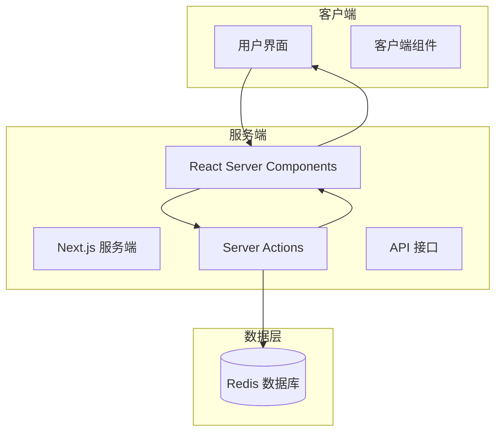
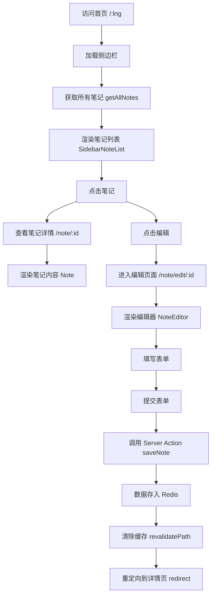

# 系统概述

<cite>
**Referenced Files in This Document**  
- [README.md](file://README.md)
- [app/[lng]/layout.tsx](file://app/[lng]/layout.tsx)
- [app/[lng]/page.tsx](file://app/[lng]/page.tsx)
- [app/[lng]/note/[id]/page.tsx](file://app/[lng]/note/[id]/page.tsx)
- [app/[lng]/note/edit/[id]/page.tsx](file://app/[lng]/note/edit/[id]/page.tsx)
- [app/[lng]/actions.ts](file://app/[lng]/actions.ts)
- [app/i18n/index.ts](file://app/i18n/index.ts)
- [lib/redis.ts](file://lib/redis.ts)
- [components/Sidebar.tsx](file://components/Sidebar.tsx)
- [components/SidebarNoteList.tsx](file://components/SidebarNoteList.tsx)
- [components/NoteEditor.tsx](file://components/NoteEditor.tsx)
</cite>

## 项目定位与核心特性

`blessed` 是一个基于 Next.js 15 构建的全栈多语言笔记应用，旨在为开发者提供一个轻量级、高性能的现代化 Web 应用实践范例。该项目不仅实现了完整的笔记创建、编辑与管理功能，更深度集成了 Next.js 的最新特性，使其成为一个优秀的学习与教学资源。

项目的核心设计目标体现在以下几个方面：
- **全栈多语言支持**：通过 `i18next` 实现中英文界面的无缝切换，支持自动语言检测与本地化资源管理。
- **高效数据持久化**：采用 Redis 作为数据存储，利用其内存数据库的特性实现高速读写，确保应用的响应性能。
- **现代化服务端架构**：充分利用 Next.js 的 Server Actions（服务端动作）在服务端直接处理表单提交与数据操作，简化了前后端交互逻辑。
- **混合渲染模式**：结合 React Server Components (RSC) 与客户端组件，实现服务端高效渲染与客户端动态交互的最佳平衡。

## 系统架构与技术选型

`blessed` 项目采用分层架构，清晰地分离了用户界面、业务逻辑与数据访问层。其技术栈的选择体现了对性能、可维护性与开发体验的综合考量。

**Diagram sources**  
- [app/[lng]/layout.tsx](file://app/[lng]/layout.tsx#L1-L40)
- [app/[lng]/actions.ts](file://app/[lng]/actions.ts#L9-L76)
- [lib/redis.ts](file://lib/redis.ts#L1-L46)

**Section sources**  
- [app/[lng]/layout.tsx](file://app/[lng]/layout.tsx#L1-L40)
- [lib/redis.ts](file://lib/redis.ts#L1-L46)

### 多语言支持 (i18n)

项目的多语言功能由 `i18next` 驱动，通过 `app/i18n/index.ts` 中的 `useTranslation` 函数为服务端组件提供翻译服务。语言资源文件（`basic.json`）按语言代码（`en`, `zh`）组织，确保了良好的可维护性。应用通过动态路由 `[lng]` 捕获语言参数，实现 URL 层面的语言隔离。

**Section sources**  
- [app/i18n/index.ts](file://app/i18n/index.ts#L1-L54)

### 数据持久化与 Redis 集成

`lib/redis.ts` 模块封装了所有与 Redis 的交互逻辑。它提供了 `getAllNotes`, `getNote`, `addNote`, `updateNote`, `delNote` 等异步函数，以哈希表（hash）的形式在 Redis 中存储笔记数据。首次访问时，若数据为空，会加载预设的初始数据。这种设计保证了数据的一致性和持久性。

**Section sources**  
- [lib/redis.ts](file://lib/redis.ts#L1-L46)

### 服务端动作 (Server Actions)

`app/[lng]/actions.ts` 是应用的业务逻辑核心。`saveNote` 和 `deleteNote` 两个 Server Actions 函数在服务端执行，负责处理笔记的增删改操作。它们利用 `zod` 进行数据验证，并在操作完成后调用 `revalidatePath` 清除缓存，确保数据一致性，最后通过 `redirect` 进行页面跳转。

**Section sources**  
- [app/[lng]/actions.ts](file://app/[lng]/actions.ts#L9-L76)

## 用户工作流与界面布局

用户的典型工作流始于访问应用首页。系统架构采用经典的两栏布局，由 `app/[lng]/layout.tsx` 定义。

**Diagram sources**  
- [app/[lng]/layout.tsx](file://app/[lng]/layout.tsx#L1-L40)
- [components/Sidebar.tsx](file://components/Sidebar.tsx#L1-L41)
- [components/SidebarNoteList.tsx](file://components/SidebarNoteList.tsx#L1-L30)
- [app/[lng]/note/[id]/page.tsx](file://app/[lng]/note/[id]/page.tsx#L1-L25)
- [app/[lng]/note/edit/[id]/page.tsx](file://app/[lng]/note/edit/[id]/page.tsx#L1-L30)
- [components/NoteEditor.tsx](file://components/NoteEditor.tsx#L1-L91)

**Section sources**  
- [app/[lng]/page.tsx](file://app/[lng]/page.tsx#L1-L16)
- [app/[lng]/note/[id]/page.tsx](file://app/[lng]/note/[id]/page.tsx#L1-L25)
- [app/[lng]/note/edit/[id]/page.tsx](file://app/[lng]/note/edit/[id]/page.tsx#L1-L30)

1.  **首页与侧边栏**：用户访问 `/:lng` 路径时，`page.tsx` 渲染一个空状态提示。`Sidebar` 组件则通过 `SidebarNoteList` 获取并展示所有笔记。
2.  **查看笔记**：点击侧边栏中的笔记项，路由跳转至 `/note/:id`，`page.tsx` 获取对应笔记数据并渲染 `Note` 组件。
3.  **编辑笔记**：点击“编辑”按钮，路由跳转至 `/note/edit/:id`，`NoteEditor` 组件加载笔记的初始值并提供表单。
4.  **保存与跳转**：用户在 `NoteEditor` 中修改内容并提交，触发 `saveNote` Server Action。操作成功后，系统自动重定向回 `/note/:id`，展示更新后的笔记。

## 教学价值与设计理念

`blessed` 项目是学习 Next.js 15 最佳实践的理想起点。它清晰地展示了如何将 Server Actions、React Server Components、动态路由与外部数据库（Redis）结合使用。其轻量级的设计避免了过度复杂的配置，让学习者能够专注于核心概念的理解。对于高级开发者，该项目展示了如何构建一个高性能、可维护的全栈应用，其模块化的设计和清晰的依赖关系为后续功能扩展提供了坚实的基础。